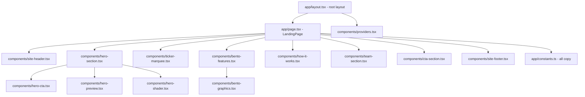
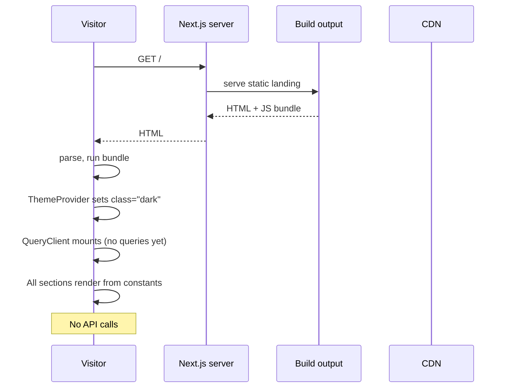

# Landing page — implementation (reading the code)

A guide for someone with the repo open. Read the files in this order.

## File map



## 1. `frontend/app/page.tsx` (27 lines)

```tsx
import { BentoFeatures } from "./components/bento-features";
import { CtaSection } from "./components/cta-section";
import { HeroSection } from "./components/hero-section";
import { HowItWorksSection } from "./components/how-it-works";
import { SiteFooter } from "./components/site-footer";
import { SiteHeader } from "./components/site-header";
import { TeamSection } from "./components/team-section";
import { MarketTickerMarquee } from "./components/ticker-marquee";

export default function LandingPage() {
  return (
    <div className="flex min-h-dvh flex-col bg-background">
      <SiteHeader />
      <main className="flex-1">
        <HeroSection />
        <MarketTickerMarquee />
        <BentoFeatures />
        <HowItWorksSection />
        <TeamSection />
        <CtaSection />
      </main>
      <SiteFooter />
    </div>
  );
}
```

Eight section components, no state, no API calls. The order is fixed and
matters — Hero at the top, CTA near the bottom before the footer.

## 2. `frontend/app/layout.tsx` (33 lines)

```tsx
const plexSans = IBM_Plex_Sans({ subsets: ["latin"], weight: [...], variable: "--font-sans" });
const plexMono = IBM_Plex_Mono({ subsets: ["latin"], weight: [...], variable: "--font-mono" });

export const metadata: Metadata = {
  title: "StockView India — Trading Terminal",
  description: "Research, signal, backtest and paper-trade Indian equities.",
};

export default function RootLayout({ children }: LayoutProps<"/">) {
  return (
    <html lang="en" className="h-full" suppressHydrationWarning>
      <body className={`${plexSans.variable} ${plexMono.variable} ...`}>
        <Providers>{children}</Providers>
      </body>
    </html>
  );
}
```

The root layout sets fonts and the page metadata. It is the **only** layout in
the `app/` tree at the top level. The `(auth)/` and `(app)/` route groups have
their own layouts (see [auth implementation](../auth/implementation.md) and
the per-app-page docs).

`suppressHydrationWarning` on `<html>` is needed because the theme attribute
is set by the client `ThemeProvider` and the server does not know which theme
to pick. Without it, the first client render would log a hydration warning.

## 3. `frontend/components/providers.tsx` (43 lines)

```tsx
const queryClient = new QueryClient({
  defaultOptions: {
    queries: {
      staleTime: 30 * 1000,
      refetchOnWindowFocus: false,
      retry: (failureCount, error) => {
        if (error instanceof ApiError && (error.status === 401 || error.status === 404)) {
          return false;
        }
        return failureCount < 2;
      },
    },
  },
});

export function Providers({ children }) {
  return (
    <ThemeProvider attribute="class" defaultTheme="dark" enableSystem={false} disableTransitionOnChange>
      <QueryClientProvider client={queryClient}>
        {children}
        <Toaster />
      </QueryClientProvider>
    </ThemeProvider>
  );
}
```

Three providers stacked:

| Provider | What it does |
|---|---|
| `ThemeProvider` (next-themes) | Manages `class="dark"` on `<html>`. Default is dark, system preference disabled (always dark for the demo). |
| `QueryClientProvider` (react-query) | The single shared QueryClient. `staleTime: 30s`, no refetch on focus, custom retry rule. |
| `Toaster` (sonner) | The toast notification system. Imported from `@/components/ui/sonner`. |

The retry rule is the important part — it stops React Query from retrying on
`ApiError` 401 (the api client already tried to refresh) and 404 (the
resource is gone).

## 4. `frontend/app/constants.ts` (201 lines)

The single source of truth for all landing copy. Eight exports:

| Export | Type | Lines |
|---|---|---|
| `NAV_LINKS` | `ReadonlyArray<{ label, href }>` | 17–21 |
| `HERO` | `{ badge, titleLines, gradientWord, subtitle, primaryCta, secondaryCta }` | 24–33 |
| `HERO_STATS` | `ReadonlyArray<[value, label]>` | 36–41 |
| `FEATURES` | `Feature[]` (6 entries) | 53–90 |
| `HOW_IT_WORKS_STEPS` | `ReadonlyArray<[step, title, desc]>` | 93–100 |
| `TEAM_MEMBERS` | `TeamMember[]` (4 entries) | 112–137 |
| `CTA_BAND` | `{ title, subtitle, button }` | 140–145 |
| `FOOTER` | `{ tagline, groups, copyright, disclaimer }` | 148–190 |
| `FOOTER_SOCIALS` | `ReadonlyArray<{ label, href, icon }>` | 193–199 |

Everything is typed with `ReadonlyArray<…> as const` so the types are
literal and immutable at runtime. This means TypeScript catches typos in the
component that consumes them.

### The `Feature` type

```typescript
export interface Feature {
  icon: LucideIcon;
  title: string;
  desc: string;
  graphic: "terminal" | "signal" | "ml" | "smc" | "nse" | "backtest" | "sectors" | "ledger";
}
```

The `graphic` field is a discriminator for `bento-graphics.tsx`. Adding a new
graphic means adding the literal to the union and handling it in the
graphics switch.

## 5. The section components

Each is a small client or server component. Here is what they each do.

### `site-header.tsx`

Server component shell with a client island for the auth area. Uses `useMe`
to decide between "Log in / Create account" and "Dashboard". Logo links to
`/`. The three nav links are in-page anchors.

### `hero-section.tsx` (97 lines)

The biggest section. Three background layers + text + preview. Renders the
`HERO` data and `HERO_STATS`. The WebGL shader (`hero-shader.tsx`) is a
client component rendered with opacity.

### `hero-preview.tsx`

A static SVG mock of the terminal — candlesticks, signal chip, indicator
overlays. Drawn with SVG primitives, no API calls. Used to give visitors a
visual idea of the real terminal without making them sign up first.

### `hero-shader.tsx`

A WebGL fragment shader. Renders a moving aurora behind the hero. The
component handles the `WebGLRenderingContext` lifecycle and falls back
silently to no shader if WebGL is unavailable.

### `ticker-marquee.tsx`

A horizontal scrolling row. CSS animation (`animation: marquee 30s linear
infinite`) translates the row from `0%` to `-50%`. The data is hardcoded in
the component (or imported from a small constant nearby).

### `bento-features.tsx` + `bento-graphics.tsx`

The 6-card bento grid. The grid layout is a CSS grid with `grid-cols-3`,
`grid-cols-2`, `grid-cols-1` responsive breakpoints. `bento-graphics.tsx`
switches on the `graphic` string and renders the matching illustration.

### `how-it-works.tsx`

4-step strip. Renders `HOW_IT_WORKS_STEPS`. The step number is large and
faded in the background; the title and description are in the foreground.

### `team-section.tsx`

4 cards from `TEAM_MEMBERS`. Each card is a small `<article>` with the
name, role, bio, and a link. Hover state on the link.

### `cta-section.tsx`

One big button. Renders `CTA_BAND`. The button links to `/register`.

### `site-footer.tsx`

The four-column footer. Renders `FOOTER` and `FOOTER_SOCIALS`. The
disclaimer is at the bottom in smaller text.

## 6. End-to-end request trace



The landing is one of the few pages in the app that does **not** hit the
backend at all. The only network activity is the initial HTML + JS bundle
load.

## 7. Adding a new section

Quick recipe for adding, say, a **pricing band** between `CtaSection` and
`SiteFooter`:

1. **Add the constant** in `constants.ts`:
   ```typescript
   export const PRICING_BAND = {
     title: "Free during the demo",
     subtitle: "No card, no broker, no risk.",
     plans: [
       { name: "Demo", price: "Free", perks: ["All features", "Paper trading"] },
       { name: "Pro", price: "TBD", perks: ["Real broker connector"] },
     ],
   } as const;
   ```

2. **Create the component** at `frontend/app/components/pricing-band.tsx`:
   ```tsx
   import { PRICING_BAND } from "../constants";
   export function PricingBand() {
     return <section id="pricing" className="...">{/* render PRICING_BAND */}</section>;
   }

3. **Wire it into the page** in `app/page.tsx`:
   ```tsx
   import { PricingBand } from "./components/pricing-band";
   ...
   <CtaSection />
   <PricingBand />
   <SiteFooter />
   ```

4. **Add to the nav** (optional) in `constants.ts`:
   ```typescript
   { label: "Pricing", href: "#pricing" }
   ```

5. **Rebuild** — the section is in the next render.

## 8. Common gotchas

- **Editing `constants.ts` does not auto-update the running site.** The
  landing is a server-rendered page. Hot reload catches most changes during
  `next dev`, but for a `next start` or production build, rebuild and redeploy.
- **`useMe` flashes during load.** The header shows "Log in / Create account"
  on the first paint, then swaps to "Dashboard" when the auth check resolves.
  This is intentional — the alternative is a skeleton loader for two
  buttons, which is worse UX.
- **The WebGL shader is heavy on low-end devices.** If the demo machine
  struggles, comment out the `<HeroShader />` line in `hero-section.tsx`.
  The CSS gradient fallback still looks good.
- **Ticker marquee data is hardcoded.** If you want live values, change
  the component to fetch from `/api/v1/market-data/market-summary` and
  rotate through the indices. Today it is static to keep the landing
  zero-dependency.
- **Team section is placeholder copy.** Real teams must edit `TEAM_MEMBERS`
  in `constants.ts` and the `href` to point at a real profile.
- **The footer link "API playground"** points to `http://localhost:8000/docs`.
  In production, change it to the deployed backend URL.
- **The hero CTA "Try the demo account"** assumes the visitor knows the demo
  credentials (`demo / demo123`). They are shown on the login page itself
  (and documented in `docs/glossary.md`).

## Related

- Frontend code: `frontend/app/`, `frontend/components/`
- Auth counterpart: [auth](../auth/overview.md)
- Glossary (terms used on the page): [glossary](../../glossary.md)
- Architecture: [architecture](../../architecture.md)
- Backend module the page is selling: [signals](../../modules/signals/overview.md) (45/40/15 fusion called out in `FEATURES`), [backtesting](../../modules/backtesting/overview.md) (six strategies), [ml](../../modules/ml/overview.md) (SHAP explanations), [nse](../../modules/nse/overview.md) (FII/DII/options), [portfolio](../../modules/portfolio/overview.md) (₹1L paper trading)
- Parent page: [overview](overview.md)