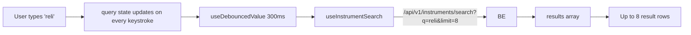
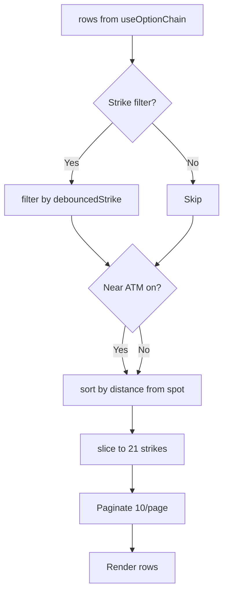

# Markets — how it works

This page walks through the page composition, the per-tab data flow, the
search pipeline, the option chain filtering, and the advance/decline ratio
bar.

## The big picture

```mermaid
flowchart TD
    Page[MarketsPage] --> Tabs[Tabs widget]
    Tabs --> T1[Tab 1: NSE Quote]
    Tabs --> T2[Tab 2: FII / DII]
    Tabs --> T3[Tab 3: Adv / Dec]
    Tabs --> T4[Tab 4: Options / PCR]
    T1 --> IQ[useInstrumentSearch]
    T1 --> NQ[useNseQuote]
    T2 --> FD[useFiiDii]
    T3 --> AD[useAdvancesDeclines]
    T4 --> OC[useOptionChain]
    IQ --> IBE[/api/v1/instruments/search]
    NQ --> NBE[/api/v1/nse/quote/SYM]
    FD --> FBE[/api/v1/nse/fii-dii]
    AD --> ABE[/api/v1/nse/advances-declines]
    OC --> OBE[/api/v1/nse/option-chain/SYM]
```

Five backend endpoints, one per tab (the quote tab uses two). The tabs
are lazy in the sense that only the active tab is mounted; switching tabs
unmounts the previous one.

## The page itself

`frontend/app/(app)/app/markets/page.tsx` (60 lines). A `"use client"`
component (because Radix Tabs requires it). The four `TabsTrigger`s are
`value="quote"`, `value="fii-dii"`, `value="breadth"`, `value="options"`.
The default is `quote`.

The Tabs widget is from `@/components/ui/tabs` (a Radix UI wrapper). The
`TabsList` is a 2-column grid on mobile, 4-column on `sm` and up.

## Tab 1 — NSE Quote

`nse-quote-tab.tsx` (163 lines). A search-driven live quote.

### State

```typescript
const [query, setQuery] = useState("");
const [selected, setSelected] = useState<Instrument | null>(null);
const debounced = useDebouncedValue(query, SEARCH_DEBOUNCE_MS);
const { data } = useInstrumentSearch(debounced, 8);
const results = data?.results ?? [];
const quote = useNseQuote(selected?.ticker ?? null);
```

- `query` — the raw input text.
- `debounced` — `query` after 300ms of no typing.
- `selected` — the chosen instrument (full record).
- `results` — up to 8 search results.
- `quote` — the NSE quote for the selected ticker (or null).

### Search pipeline



The debounce matters. Without it, every keystroke fires a request. With
it, the request only fires when the user pauses for 300ms.

### Quote card

Once a result is clicked, `selected` is set and the `useNseQuote` hook
fires. The hook hits `/api/v1/nse/quote/{symbol}`. The backend's NSE
module runs the 4-layer fallback chain (NSE direct → nsepython →
yfinance fast_info → yfinance history).

The card shows 8 stats in a 4×2 grid:

| Cell | Source | InfoTip |
|---|---|---|
| Open | `quote.open` | — |
| Prev close | `quote.prev_close` | — |
| Day high | `quote.day_high` | — |
| Day low | `quote.day_low` | — |
| 52W high | `quote.week_high` | "The highest price traded in the past year." |
| 52W low | `quote.week_low` | "The lowest price traded in the past year." |
| Volume | `quote.volume` | "Total shares traded today." |
| VWAP | `quote.vwap` | "Volume-Weighted Average Price — the day's average price weighted by how many shares traded at each level. A rough 'fair price' for the day: above it = buyers in control." |

The VWAP tip is the only long one — the rest are short or omitted.

### Empty / loading states

- No query, no selected → "Search to see a live NSE quote" with a hint
  "Try RELIANCE, TCS or HDFCBANK."
- Query with no results → the result list does not show (the `&& results.length > 0` guard).
- Selected, quote loading → a 224px skeleton.
- Selected, quote loaded → the QuoteCard.

## Tab 2 — FII / DII

`fii-dii-tab.tsx` (187 lines).

### State

```typescript
const { data, isLoading, isError } = useFiiDii();
const [page, setPage] = useState(0);
const rows = data?.rows ?? [];
const latest = rows[0];
const fiiSeries = [...rows].reverse().map((r) => r.fii_net);
const diiSeries = [...rows].reverse().map((r) => r.dii_net);
```

- `rows` — the data array, newest-first.
- `latest` — the most recent session (index 0).
- `fiiSeries` / `diiSeries` — the FII/DII net values reversed so they
  read left-to-right chronologically (oldest first).

### Why reverse?

The backend returns rows newest-first (the most recent trading day at
index 0). A sparkline reads left-to-right with the leftmost being
"oldest" and rightmost "newest". So the array is reversed before being
passed to the `Sparkline` component.

### The summary cards

Two cards at the top: FII net and DII net.

```typescript
<Card>
  <CardHeader>
    <CardTitle>
      <Globe2 /> FII net
      <span>₹ Cr</span>
      <InfoTip>{tip}</InfoTip>
    </CardTitle>
  </CardHeader>
  <CardContent>
    <p className={cn("font-mono text-xl", net >= 0 ? "text-up" : "text-down")}>
      {formatSigned(net)}
    </p>
    <Sparkline values={series} />
  </CardContent>
</Card>
```

The `formatSigned` formatter prepends a `+` to non-negative numbers. The
`Sparkline` is a small inline chart from `@/components/charts/sparkline`
— a polyline of the values, no axes, just a curve.

### Session cards

```typescript
<SessionCard row={row} latest={safePage === 0 && i === 0} />
```

The `latest` prop is true only on the first card of the first page. It
shows the "Latest" pill.

Each card has:
- The date (mono, muted, 12px).
- The "Latest" pill (if applicable).
- FII net + buy/sell (left half).
- DII net + buy/sell (right half).

The buy/sell lines are tiny: "buy 4,500 · sell 3,250". They give context
behind the net.

### Pager

`Pager` is the shared component used by both this tab and the Options
tab. It renders "Page X of Y · {hint}" and Prev/Next chevrons. The hint
is `${rows.length} sessions` for FII/DII, `${visibleRows.length} strikes`
for Options.

## Tab 3 — Advances / Declines

`advances-declines-tab.tsx` (148 lines). The simplest tab.

### State

```typescript
const { data, isLoading, isError, refetch } = useAdvancesDeclines();
const advances = data?.advances ?? 0;
const declines = data?.declines ?? 0;
const unchanged = data?.unchanged ?? 0;
const total = Math.max(advances + declines + unchanged, 1);
const advPct = (advances / total) * 100;
const unchPct = (unchanged / total) * 100;
```

`total` is clamped to 1 (so division never blows up). `advPct` and
`unchPct` are the percentages of advancing and unchanged members. The
remaining `100 - advPct - unchPct` is the declining percentage.

### Three stat tiles

One card per metric: Advancing, Declining, Unchanged. Each has:
- An icon (Up arrow, Down arrow, Equals sign).
- The metric name (uppercase, mono, 11px).
- The big number (mono, 3xl).

The colour matches the tone — green for advancing, red for declining,
muted for unchanged.

### Ratio bar

```typescript
<div className="flex h-3 w-full overflow-hidden rounded-full bg-muted">
  <div className="h-full bg-up transition-all duration-300" style={{ width: `${advPct}%` }} />
  <div className="h-full bg-muted-foreground/40" style={{ width: `${unchPct}%` }} />
  <div className="h-full bg-down" style={{ width: `${100 - advPct - unchPct}%` }} />
</div>
```

A single horizontal bar split into three segments: advancing (green),
unchanged (grey), declining (red). The widths are the percentages. The
total always adds to 100%.

Below the bar: "X% advancing · A/D ratio Y · N declining".

The A/D ratio is `advances / max(declines, 1)`. The `max(…, 1)` prevents
division by zero. An A/D ratio of 1.0 means equal advances and declines;
above 1 means more advances; below 1 means more declines.

## Tab 4 — Options / PCR

`options-tab.tsx` (301 lines). The most complex tab.

### State

```typescript
const [symbol, setSymbol] = useState<string>(DEFAULT_OPTION_SYMBOL);  // "NIFTY"
const [customSymbol, setCustomSymbol] = useState("");
const debouncedCustom = useDebouncedValue(customSymbol.trim().toUpperCase(), SEARCH_DEBOUNCE_MS);
const effectiveCustom = debouncedCustom.length >= 2 ? debouncedCustom : "";
const chainSymbol = effectiveCustom || symbol;

const [nearAtm, setNearAtm] = useState(true);
const [strikeQuery, setStrikeQuery] = useState("");
const debouncedStrike = useDebouncedValue(strikeQuery.trim(), SEARCH_DEBOUNCE_MS);
const [page, setPage] = useState(0);
```

- `symbol` — the active index chip (NIFTY by default).
- `customSymbol` — the custom equity input.
- `debouncedCustom` — the custom input after 300ms.
- `effectiveCustom` — `debouncedCustom` if it's at least 2 chars, else "".
- `chainSymbol` — `effectiveCustom` wins over the index chip.
- `nearAtm` — the "Near ATM" toggle.
- `strikeQuery` — the strike filter input.

The `effectiveCustom` threshold (2 chars) prevents single-character
queries that would match too many tickers.

### Symbol picker

```typescript
<div className="flex items-center gap-1 rounded-lg border border-border bg-card p-1">
  {OPTION_INDICES.map((idx) => (
    <ToggleChip
      key={idx}
      active={!effectiveCustom && symbol === idx}
      onClick={() => { setSymbol(idx); setCustomSymbol(""); setPage(0); }}
    >
      {idx}
    </ToggleChip>
  ))}
</div>
<Input
  value={customSymbol}
  onChange={(e) => { setCustomSymbol(e.target.value.toUpperCase()); setPage(0); }}
  placeholder="Or equity symbol…"
  ...
/>
```

Four index chips (NIFTY, BANKNIFTY, FINNIFTY, MIDCPNIFTY) and a custom
input. The chips are active only when no custom symbol is set
(`!effectiveCustom && symbol === idx`).

### Summary cards

Three cards: Spot, PCR, Max pain. Each has an InfoTip explaining the
metric. PCR and max pain are computed by the backend's NSE module.

### The chain table



The filtering pipeline:

1. **Strike filter**: if the user typed a strike value, keep only rows
   where the strike (as a string) contains the query.
2. **Near ATM**: if the toggle is on, sort by `|strike − spot|` and take
   the first 21.
3. **Pagination**: 10 rows per page.

The ATM row (the row whose strike is closest to the spot) is highlighted
with `bg-primary/5`. The detection is:

```typescript
spot > 0 &&
Math.abs(r.strike - spot) === Math.min(...visibleRows.map((x) => Math.abs(x.strike - spot)))
```

This finds the minimum distance across all visible rows, then highlights
the row whose distance matches. The `Math.min(...)` is recomputed for
every row — not ideal, but the list is small (max 21).

### HeadCell

The table headers use a `HeadCell` helper that wraps the label in a
tooltip:

```typescript
function HeadCell({ children, tip, align = "right" }) {
  return (
    <th className={cn("px-4 py-2 ...", align === "right" ? "text-right" : "text-left")}>
      <span className={cn("inline-flex items-center gap-1", align === "right" && "flex-row-reverse")}>
        {children}
        <InfoTip label={`What is ${children}?`}>{tip}</InfoTip>
      </span>
    </th>
  );
}
```

The `flex-row-reverse` for right-aligned cells puts the icon **before**
the label so the order reads correctly. Every column has a tip explaining
what the metric means.

## The shared `Pager`

`pager.tsx` (58 lines). A simple Prev/Next chevron pager. Used by FII/DII
sessions and option chain strikes.

```typescript
<div className="flex items-center justify-between gap-3 px-4 py-3">
  <span className="font-mono text-xs text-muted-foreground">
    Page {page + 1} of {pageCount}{hint ? ` · ${hint}` : ""}
  </span>
  <div className="flex items-center gap-1">
    <button disabled={page === 0} onClick={() => onPage(Math.max(0, page - 1))}>
      <ChevronLeft />
    </button>
    <button disabled={page >= pageCount - 1} onClick={() => onPage(Math.min(pageCount - 1, page + 1))}>
      <ChevronRight />
    </button>
  </div>
</div>
```

The hint is the count of items (e.g. "10 sessions"). The disabled state
is `disabled:pointer-events-none disabled:opacity-40` — the button is
still in the tab order but not interactive.

## What can go wrong

| Symptom | Cause |
|---|---|
| NSE Quote: search shows no results | The query does not match any NSE instrument. Try the full name (e.g. "Reliance Industries"). |
| NSE Quote: 502 | All 4 fallback layers failed. Common from non-India IPs. The card shows nothing. |
| FII/DII: source is "static" | The backend's static fixture is being served (all 4 live sources failed). The data is from the 10-day fixture. |
| FII/DII: empty | The backend's NSE module failed. The tab shows "Flows unavailable right now". |
| Advances/Declines: all 0 | The backend's NSE breadth fallback computed 0 advancing and 0 declining. Check the date — it might be a holiday. |
| Options: "Option chain unavailable for this symbol" | The symbol is not F&O. NSE option chains only exist for F&O stocks and indices. |
| Options: 502 for an index | The NSE chain API is blocked. Wait or try a different index. |
| Options: PCR shows "—" | Total call OI is 0. The chain is degenerate. |
| Options: Max pain shows "—" | No strike data. |
| Options: ATM row not highlighted | The chain is empty. The `spot > 0` guard fails. |

Related: [implementation](implementation.md) for the file map and the
request traces.