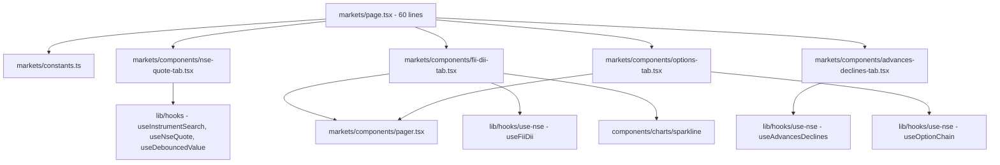
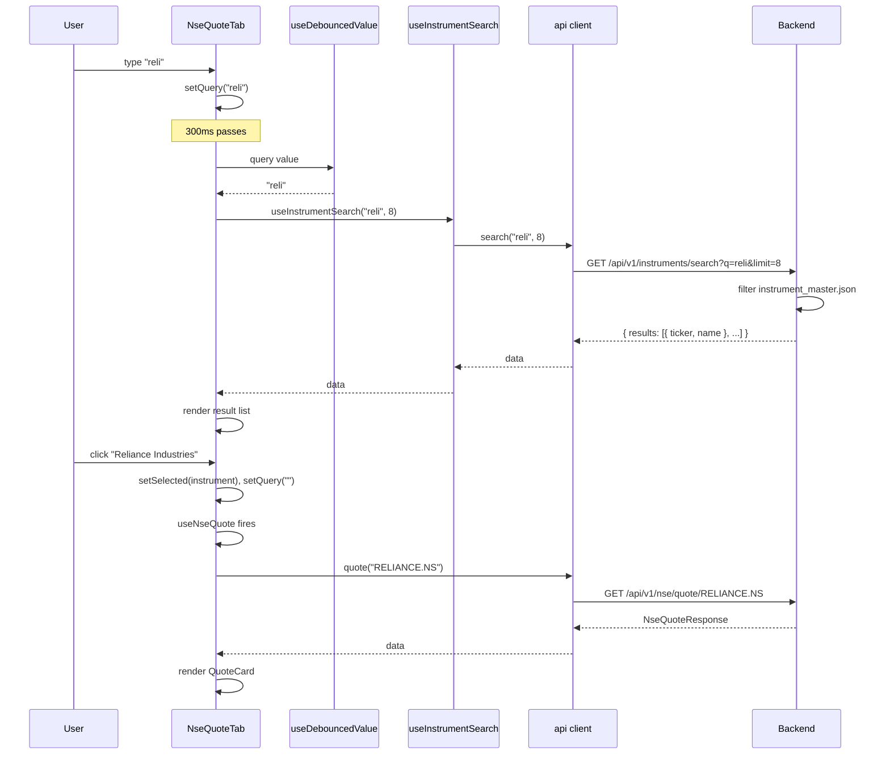
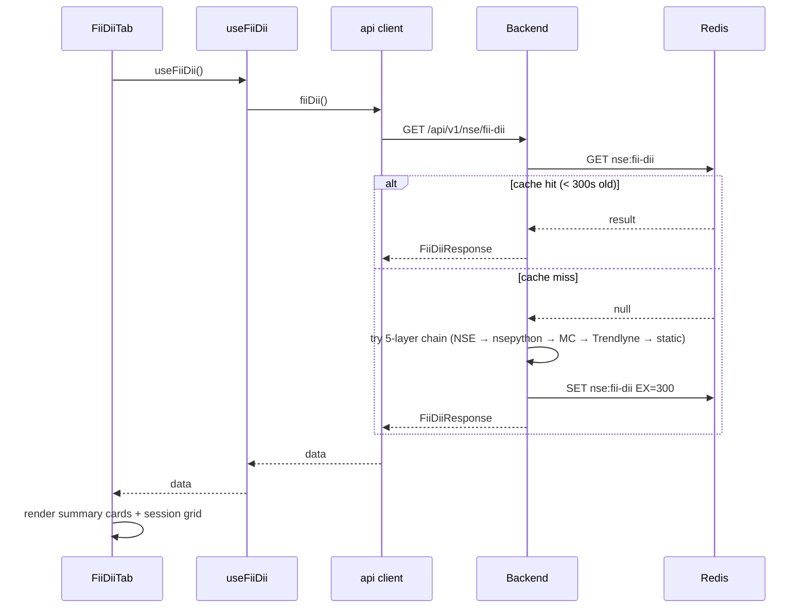

# Markets — implementation (reading the code)

A guide for someone with the repo open. Read the files in this order.

## File map



## 1. `frontend/app/(app)/app/markets/page.tsx` (60 lines)

```tsx
"use client";

import { Activity, CandlestickChart, Landmark, Scale } from "lucide-react";
import { Tabs, TabsContent, TabsList, TabsTrigger } from "@/components/ui/tabs";
import { AdvancesDeclinesTab } from "./components/advances-declines-tab";
import { FiiDiiTab } from "./components/fii-dii-tab";
import { NseQuoteTab } from "./components/nse-quote-tab";
import { OptionsTab } from "./components/options-tab";

export default function MarketsPage() {
  return (
    <div className="mx-auto max-w-6xl space-y-5">
      <div>
        <h1 className="text-2xl font-semibold">Markets — India (NSE)</h1>
        <p className="mt-0.5 text-sm text-muted-foreground">Live quotes, institutional flows, market breadth and options data.</p>
      </div>

      <Tabs defaultValue="quote">
        <TabsList className="grid h-auto w-full grid-cols-2 gap-1 sm:grid-cols-4" aria-label="Market data sections">
          <TabsTrigger value="quote" className="gap-1.5 py-2"><CandlestickChart className="size-4" />NSE Quote</TabsTrigger>
          <TabsTrigger value="fii-dii" className="gap-1.5 py-2"><Landmark className="size-4" />FII / DII</TabsTrigger>
          <TabsTrigger value="breadth" className="gap-1.5 py-2"><Activity className="size-4" />Advances / Declines</TabsTrigger>
          <TabsTrigger value="options" className="gap-1.5 py-2"><Scale className="size-4" />Options / PCR</TabsTrigger>
        </TabsList>
        <TabsContent value="quote"><NseQuoteTab /></TabsContent>
        <TabsContent value="fii-dii"><FiiDiiTab /></TabsContent>
        <TabsContent value="breadth"><AdvancesDeclinesTab /></TabsContent>
        <TabsContent value="options"><OptionsTab /></TabsContent>
      </Tabs>
    </div>
  );
}
```

A `"use client"` page. The `Tabs` widget is from Radix. The four
`TabsContent` children mount lazily — switching to a different tab
unmounts the previous one and triggers a fresh data fetch.

## 2. `frontend/app/(app)/app/markets/constants.ts` (12 lines)

```typescript
export const OPTION_INDICES = ["NIFTY", "BANKNIFTY", "FINNIFTY", "MIDCPNIFTY"] as const;
export type OptionIndex = (typeof OPTION_INDICES)[number];
export const DEFAULT_OPTION_SYMBOL = "NIFTY";
export const CHAIN_PAGE_SIZE = 10;
export const SESSIONS_PAGE_SIZE = 4;
export const SEARCH_DEBOUNCE_MS = 300;
```

Six constants. The indices match the NSE chain API's supported symbols.
`DEFAULT_OPTION_SYMBOL` is what the options tab shows on first load.

## 3. `components/nse-quote-tab.tsx` (163 lines)

The search-driven quote tab. Two main components:

| Component | Purpose |
|---|---|
| `QuoteCard` | The data card for the selected symbol |
| `NseQuoteTab` | The search + results + card layout |

### Key code: search

```typescript
const [query, setQuery] = useState("");
const debounced = useDebouncedValue(query, SEARCH_DEBOUNCE_MS);
const { data } = useInstrumentSearch(debounced, 8);
```

`useInstrumentSearch(q, limit)` is a React Query hook that hits
`/api/v1/instruments/search?q={q}&limit={limit}`. The `limit` cap is
8 results.

### Key code: results list

```tsx
{debounced && results.length > 0 && (
  <Card>
    <CardContent className="max-h-64 divide-y divide-border overflow-y-auto p-1">
      {results.map((r) => (
        <button key={r.ticker} type="button" onClick={() => { setSelected(r); setQuery(""); }} className="...">
          <span className="flex items-center gap-2 truncate">
            <TrendingUp className="size-3.5 text-muted-foreground" />
            {r.name}
          </span>
          <span className="font-mono text-xs text-muted-foreground">{r.ticker}</span>
        </button>
      ))}
    </CardContent>
  </Card>
)}
```

The results list shows only when `debounced` is non-empty **and** there
are results. The list is scrollable (`max-h-64 overflow-y-auto`) so it
does not push the page down.

Clicking a result sets `selected` to the full instrument and clears the
query (so the results list collapses).

### Key code: QuoteCard

The 8-stat grid is built from an array of `[label, value, tip]` tuples:

```typescript
{[
  ["Open", formatINR(quote.open), undefined],
  ["Prev close", formatINR(quote.prev_close), undefined],
  ...
  ["VWAP", formatINR(quote.vwap), "Volume-Weighted Average Price — ..."],
].map(([label, value, tip]) => (
  <div key={label} className="flex items-center justify-between rounded-lg bg-muted/60 px-3 py-2">
    <span className="flex items-center gap-1 text-xs text-muted-foreground">
      {label}
      {tip ? <InfoTip label={`What is ${label}?`}><span className="max-w-52">{tip}</span></InfoTip> : null}
    </span>
    <span className="font-mono text-sm font-medium">{value}</span>
  </div>
))}
```

The InfoTip is conditional on `tip !== undefined`. The 8 cells are
rendered in a 2/3/4-column grid depending on the breakpoint.

## 4. `components/fii-dii-tab.tsx` (187 lines)

Three components:

| Component | Purpose |
|---|---|
| `FlowSide` | One side (FII or DII) of a session card |
| `SessionCard` | One trading day's FII + DII flows |
| `FiiDiiTab` | The summary cards + paged session grid |

### Key code: sparkline reversal

```typescript
const fiiSeries = [...rows].reverse().map((r) => r.fii_net);
const diiSeries = [...rows].reverse().map((r) => r.dii_net);
```

The backend returns rows newest-first. Sparklines read left-to-right
chronologically. The reversal puts the oldest value on the left.

The spread (`[...rows]`) makes a shallow copy so `rows` is not mutated.

### Key code: page slicing

```typescript
const pageCount = Math.max(1, Math.ceil(rows.length / SESSIONS_PAGE_SIZE));
const safePage = Math.min(page, pageCount - 1);
const pageRows = rows.slice(safePage * SESSIONS_PAGE_SIZE, (safePage + 1) * SESSIONS_PAGE_SIZE);
```

Standard pagination. `safePage` clamps `page` to `[0, pageCount - 1]` so
out-of-bounds pages don't break the slice.

### Key code: "Latest" badge

```typescript
<SessionCard row={row} latest={safePage === 0 && i === 0} />
```

The first card of the first page gets the "Latest" pill. This is the
most recent trading day.

## 5. `components/advances-declines-tab.tsx` (148 lines)

The simplest tab. One `StatTile` component, used three times.

### Key code: percentage math

```typescript
const total = Math.max(advances + declines + unchanged, 1);
const advPct = (advances / total) * 100;
const unchPct = (unchanged / total) * 100;
```

`total` is clamped to 1 to prevent division by zero. `advPct` and
`unchPct` are the percentages. The remaining `100 - advPct - unchPct` is
the declining percentage.

### Key code: ratio bar

```tsx
<div className="flex h-3 w-full overflow-hidden rounded-full bg-muted">
  <div className="h-full bg-up transition-all duration-300" style={{ width: `${advPct}%` }} />
  <div className="h-full bg-muted-foreground/40" style={{ width: `${unchPct}%` }} />
  <div className="h-full bg-down" style={{ width: `${100 - advPct - unchPct}%` }} />
</div>
```

Three sibling divs, each with a width %. The total always sums to 100%.
The `transition-all duration-300` makes the widths animate when the
underlying data changes.

## 6. `components/options-tab.tsx` (301 lines)

The most complex tab. Many pieces:

| Piece | Purpose |
|---|---|
| `ToggleChip` | A reusable toggle button for symbol chips |
| `HeadCell` | A table header cell with InfoTip |
| `OptionsTab` | The whole tab |

### Key code: chainSymbol resolution

```typescript
const effectiveCustom = debouncedCustom.length >= 2 ? debouncedCustom : "";
const chainSymbol = effectiveCustom || symbol;
```

The custom symbol wins if it's at least 2 chars. Otherwise the index
chip selection wins. The 2-char minimum prevents accidental single-char
searches (which would match too many tickers).

### Key code: chain filtering

```typescript
const visibleRows = useMemo(() => {
  let list = [...rows];
  if (debouncedStrike) list = list.filter((r) => String(r.strike).includes(debouncedStrike));
  if (nearAtm && spot > 0) {
    list.sort((a, b) => Math.abs(a.strike - spot) - Math.abs(b.strike - spot));
    list = list.slice(0, 21);
  }
  return list;
}, [rows, debouncedStrike, nearAtm, spot]);
```

Three steps in order:
1. Spread `rows` into a mutable copy.
2. If a strike filter is set, keep only matching rows.
3. If "Near ATM" is on and the spot is known, sort by distance from spot
   and take the closest 21.

The 21 number is "~10 strikes each side" plus the ATM row.

### Key code: ATM row highlight

```typescript
spot > 0 &&
Math.abs(r.strike - spot) === Math.min(...visibleRows.map((x) => Math.abs(x.strike - spot)))
```

The ATM row is the one whose distance to the spot equals the minimum
distance. This is recomputed per row, which is O(n²) for n visible
rows (max 21, so 441 operations — fine).

A cleaner approach would be to compute the ATM strike once and compare:

```typescript
const atmStrike = visibleRows.reduce((min, r) => Math.abs(r.strike - spot) < Math.abs(min - spot) ? r.strike : min, visibleRows[0]?.strike);
spot > 0 && r.strike === atmStrike
```

This is O(n) instead. The current code works fine for the small
list size.

### Key code: page state reset

Every input change resets the page to 0:

```typescript
onChange={(e) => { setStrikeQuery(e.target.value); setPage(0); }}
onChange={(e) => { setCustomSymbol(e.target.value.toUpperCase()); setPage(0); }}
onClick={() => { setNearAtm((v) => !v); setPage(0); }}
```

This prevents the "I'm on page 5 but I changed a filter and now page 5 is
empty" problem.

## 7. `components/pager.tsx` (58 lines)

The shared pager. Already covered. The key code:

```typescript
<button disabled={page === 0} onClick={() => onPage(Math.max(0, page - 1))} aria-label="Previous page" className="...">
  <ChevronLeft className="size-4" />
</button>
<button disabled={page >= pageCount - 1} onClick={() => onPage(Math.min(pageCount - 1, page + 1))} aria-label="Next page" className="...">
  <ChevronRight className="size-4" />
</button>
```

The `Math.max(0, page - 1)` and `Math.min(pageCount - 1, page + 1)`
clamps the new page so the disabled state is the only guard. The
disabled state is `opacity-40 pointer-events-none`.

## 8. The hooks used

| Hook | Endpoint |
|---|---|
| `useInstrumentSearch(q, limit)` | `GET /instruments/search?q={q}&limit={limit}` |
| `useNseQuote(symbol)` | `GET /nse/quote/{symbol}` |
| `useFiiDii()` | `GET /nse/fii-dii` |
| `useAdvancesDeclines()` | `GET /nse/advances-declines` |
| `useOptionChain(symbol)` | `GET /nse/option-chain/{symbol}` |
| `useDebouncedValue(value, ms)` | (no API) — local hook |

All hooks except `useDebouncedValue` are React Query queries. The NSE
hooks cache for 60s (quotes), 120s (chains), 300s (FII/DII). The
instruments search is per-query-key.

## 9. End-to-end request trace — NSE Quote search

You type "reli" on the NSE Quote tab:



Two requests: the search (debounced) and the quote (on click).

## 10. End-to-end request trace — FII/DII page load

You click the FII/DII tab. The `FiiDiiTab` mounts:



One API call on tab mount. The backend cache makes repeat calls instant.

## 11. Common gotchas

- **Switching tabs re-fetches.** Each `TabsContent` is mounted on
  activation. The hook fires the request. The 60–300s cache makes this
  fast for repeat visits, but a fresh tab is always a network call.
- **The NSE Quote search fires on every 300ms pause.** Not on every
  keystroke. If the user types quickly, the search only runs after they
  stop.
- **The result list is hidden when empty.** The `&& results.length > 0`
  guard means "no results" looks the same as "no query". This is
  intentional — empty state would be noisy.
- **The FII/DII sparkline uses reversed data.** If you change the
  backend to return oldest-first, the sparkline will read right-to-left.
- **The "Latest" badge is on the first card of the first page only.**
  Sorting or filtering the sessions would not move the badge.
- **The options table highlights the ATM row.** The detection uses
  `Math.min(...visibleRows.map(...))` which is O(n) per row. With 21
  visible rows, the render is 441 comparisons — fine.
- **Custom symbol clears the index chip.** When you type in the custom
  input, the chips are deactivated. When you clear it, the chips are
  reactivated.
- **The pager is disabled, not hidden.** When there's only 1 page, the
  pager is hidden via `pageCount > 1`. When there's 0 pages (empty
  data), the pager shows "Page 0 of 0" with both buttons disabled.
- **The tabs are keyboard-accessible.** Radix Tabs handles keyboard nav
  (arrow keys to switch tabs, tab to focus content).

## Related

- Backend counterpart for every tab:
  - [nse module](../../modules/nse/overview.md) — covers all 4 endpoints and
    the 4-layer fallback chains.
  - [instruments module](../../modules/instruments/overview.md) — the
    search endpoint and the JSON master.
- Sibling page: [sectors](../sectors/overview.md) — uses the same NSE
  sector performance endpoint.
- Parent page: [overview](overview.md).