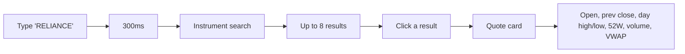
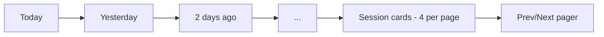
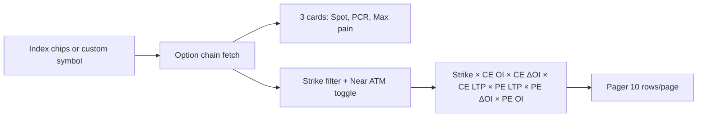

# Markets — what it is

The Markets page is the **NSE-focused overview at `/app/markets`**. It
groups four live NSE data feeds into a single tabbed view so users can
switch between them without leaving the page.

The four tabs are:

| Tab | What it shows |
|---|---|
| **NSE Quote** | A search-driven live quote for any NSE-listed stock |
| **FII / DII** | Foreign and domestic institutional flows, with sparkline trends |
| **Advances / Declines** | Nifty 50 breadth — how many members are up vs down |
| **Options / PCR** | Option chain for an index or equity, with PCR and max-pain |

The page is the front door for NSE data. Every backend module that touches
NSE-specific data feeds into one of these tabs.

## What visitors see

A title "Markets — India (NSE)" with a subtitle "Live quotes,
institutional flows, market breadth and options data." Below that, a
4-tab strip with icons. The default tab is NSE Quote.

### Tab 1 — NSE Quote

You type a stock name. After 300ms the search runs against the
`instruments` module's master list (646 NSE instruments). Up to 8 results
show below. Click one. A quote card appears with 8 data points.

The card has the company name, ticker, "NSE" badge, trading status, the
big last price, the change %, and an 8-cell stat grid.

### Tab 2 — FII / DII

Two summary cards at the top: FII net and DII net, with sparkline trends
over the last N days. Below, "Recent sessions" — a grid of session cards
(one per trading day), each showing FII buy/sell/net and DII buy/sell/net.
4 sessions per page, paged.

The "Latest" badge marks the most recent session. Session cards are
newest-first; sparklines read left-to-right chronologically (so the
reversing of the array matters).

### Tab 3 — Advances / Declines

Three big stat tiles (Advancing, Declining, Unchanged) for the Nifty 50
constituents, plus a ratio bar (advancing / unchanged / declining
percentages) and an A/D ratio.

The A/D ratio is `advances / max(declines, 1)`. Well above 1 = broad
strength; well below 1 = broad weakness.

### Tab 4 — Options / PCR

Four index chips (NIFTY, BANKNIFTY, FINNIFTY, MIDCPNIFTY) plus a custom
equity input. Three summary cards: Spot, PCR (Put-Call ratio), Max pain.
The chain table has 7 columns: Strike, CE OI, CE ΔOI, CE LTP, PE LTP,
PE ΔOI, PE OI. Each column has an InfoTip explaining what it is.

The "Near ATM" toggle filters to ~10 strikes each side of the current
spot (21 total). Without the toggle, the full chain is shown.

## A real example

You open `/app/markets` and click the FII/DII tab:

- **FII net**: `+1,250` (green) with a sparkline trending up over the
  last 10 sessions.
- **DII net**: `−480` (red) with a sparkline dipping in the last 3 days.
- **Recent sessions**:
  - 17-Apr-2026 (Latest): FII +1,250 · DII −480.
  - 16-Apr-2026: FII +820 · DII +1,100.
  - 15-Apr-2026: FII −340 · DII +620.
  - 14-Apr-2026: FII +1,500 · DII −200.
- 4 sessions per page. Click "Next" to see earlier sessions.

You switch to the Options tab, pick NIFTY. The summary cards show:
- Spot: 24,580
- PCR: 0.92 (slightly more calls than puts)
- Max pain: 24,500

The chain table shows 10 rows per page. You toggle "Near ATM" to see only
strikes around 24,580. The ATM strike row is highlighted with a subtle
`bg-primary/5`.

## What the page does not do

- **It does not let you set alerts.** Use `/app/alerts` for that.
- **It does not show historical NSE data.** The feeds are real-time
  snapshots.
- **It does not show BSE data.** NSE-only. BSE instruments are on the
  stock terminal and search.
- **It does not show derivatives beyond options.** Futures are out of
  scope.

## Where it lives in the codebase

- Page: `frontend/app/(app)/app/markets/page.tsx` (60 lines)
- Constants: `frontend/app/(app)/app/markets/constants.ts`
- Tabs:
  - `components/nse-quote-tab.tsx` (163 lines)
  - `components/fii-dii-tab.tsx` (187 lines)
  - `components/advances-declines-tab.tsx` (148 lines)
  - `components/options-tab.tsx` (301 lines)
  - `components/pager.tsx` (58 lines) — shared Prev/Next pager

## Backend modules used

- [NSE](../../modules/nse/overview.md) — the primary backend. All 4 tabs call this
  module's 4 endpoints (`/quote`, `/fii-dii`, `/advances-declines`, `/option-chain`).
  Falls through to Trendlyne, then a static fixture, on NSE failure.
- [Market data](../../modules/market-data/overview.md) — backup for the NSE quote tab.
- [Instruments](../../modules/instruments/overview.md) — symbol search in the NSE quote tab.

## Related pages in this folder

- [How it works](how-it-works.md) — the per-tab data flow, the search
  pipeline, the option chain filtering, the sparkline reversal, the
  advance/decline ratio bar.
- [Implementation](implementation.md) — file map, the `useOptionChain`
  hook, the squarified treemap math, every formatter, request traces.