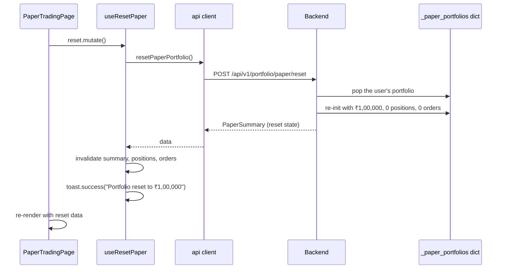

# Paper trading — how it works

This page walks through the page state, the order ticket, the summary
stat cards, the positions table, the orders table, the reset flow, and
the LTP update flow.

## The big picture

```mermaid
flowflowchart TD
    Page[PaperTradingPage] --> Summary[usePaperSummary]
    Page --> Reset[useResetPaper]
    Page --> Ticket[OrderTicket - component]
    Page --> PosTab[PositionsTable]
    Page --> OrdTab[OrdersTable]
    Ticket --> Place[usePlacePaperOrder]
    Ticket --> WS[useWatchlistTickers - quick-pick]
    PosTab --> PosHook[usePaperPositions]
    OrdTab --> OrdHook[usePaperOrders]
    Summary -->|GET /portfolio/paper| BE[Backend]
    PosHook -->|GET /portfolio/paper/positions| BE
    OrdHook -->|GET /portfolio/paper/orders| BE
    Place -->|POST /portfolio/paper/order| BE
    Reset -->|POST /portfolio/paper/reset| BE
    BE --> Memory[In-memory per-user dict]
    Place --> Cache[Invalidate summary, positions, orders]
    Reset --> Cache
```

Five backend endpoints. The paper portfolio lives in the backend's
in-memory dict (per user). When an order is placed, the summary +
positions + orders queries are invalidated and refetched.

## The page state

The page itself is stateless — it has no `useState` calls. The summary
is fetched on mount. The reset button triggers a mutation.

The `OrderTicket` component has its own local state for the order
form. The `PositionsTable` and `OrdersTable` are stateless — they
just render the data from their respective hooks.

## The summary cards

```typescript
const summary = usePaperSummary();
...
{summary.isLoading ? (
  <Skeleton />
) : summary.data ? (
  <div className="grid grid-cols-2 gap-3 sm:grid-cols-4">
    <StatCard label="Cash" value={`₹${summary.data.cash.toLocaleString("en-IN")}`} icon={<Banknote />} />
    <StatCard label="Positions" value={String(summary.data.positions_count)} icon={<Package />} tone="text-ai" />
    <StatCard label="Orders" value={String(summary.data.orders_count)} icon={<History />} tone="text-gold" />
    <StatCard label="Realised P&L" value={`${summary.data.pnl >= 0 ? "+" : ""}₹${summary.data.pnl.toLocaleString("en-IN", { maximumFractionDigits: 2 })}`} icon={<BarChart3 />} tone={summary.data.pnl >= 0 ? "text-up" : "text-down"} />
  </div>
) : null}
```

Four cards:
- **Cash**: `summary.data.cash` in ₹.
- **Positions**: `summary.data.positions_count` (integer).
- **Orders**: `summary.data.orders_count` (integer).
- **Realised P&L**: `summary.data.pnl` (signed). Green if ≥ 0, red
  otherwise.

The cards have icons. The icons are coloured by `tone` (positions =
ai-blue, orders = gold, P&L = green/red).

## The order ticket

`OrderTicket` (~155 lines). Local state:

```typescript
const [symbol, setSymbol] = useState("");
const [side, setSide] = useState<"BUY" | "SELL">("BUY");
const [qty, setQty] = useState(1);
const [price, setPrice] = useState("");
```

Four fields. Defaults: empty symbol, BUY side, qty 1, empty price.

### The symbol field

```tsx
<SymbolSearch value={symbol} onChange={(t) => setSymbol(t)} placeholder="Search stock…" />
```

The shared `SymbolSearch` component (used across the app). Type a few
letters, get autocomplete suggestions, click to select. The selected
value is the full ticker (e.g. `RELIANCE.NS`).

### Quick-pick from watchlist

```tsx
{watchlistTickers.size > 0 && (
  <div className="flex flex-wrap gap-1">
    {Array.from(watchlistTickers).slice(0, 4).map((t) => (
      <button key={t} type="button" onClick={() => setSymbol(t)} className={cn("...", symbol === t ? "border-ai bg-ai/10 text-ai" : "border-border text-muted-foreground hover:bg-muted")}>
        {t.replace(".NS", "")}
      </button>
    ))}
  </div>
)}
```

Up to 4 watchlist tickers are shown as small chips. The currently-
selected symbol's chip is highlighted with the AI colour. The
`Array.from(...)` converts the `Set<string>` to an array (React needs
arrays for `.map`).

This is a small but important UX feature — the user does not have to
re-search for a stock they already follow.

### The side toggle

```tsx
{(["BUY", "SELL"] as const).map((s) => (
  <button key={s} type="button" onClick={() => setSide(s)} className={cn(
    "flex-1 rounded-md border py-1.5 text-xs font-semibold transition-colors",
    side === s
      ? s === "BUY"
        ? "border-up bg-up/10 text-up"
        : "border-down bg-down/10 text-down"
      : "border-border text-muted-foreground hover:bg-muted",
  )}>{s}</button>
))}
```

Two buttons, mutually exclusive. The active button is highlighted
with the side's colour (green for BUY, red for SELL).

### The qty field

```tsx
<Input id="qty" type="number" min={1} value={qty} onChange={(e) => setQty(Math.max(1, parseInt(e.target.value) || 1))} className="font-mono text-sm" />
```

The `Math.max(1, parseInt(...) || 1)` clamp ensures qty is at least 1.
`parseInt` of an empty string returns `NaN`; the `|| 1` fallback
handles this.

### The price field

```tsx
<Input id="price" type="number" min={0.01} step={0.05} placeholder="0.00" value={price} onChange={(e) => setPrice(e.target.value)} className="font-mono text-sm" />
```

`step={0.05}` is a UI hint (the up/down arrows step by 0.05). The
actual value can be any positive number.

### The estimated cost line

```tsx
<span>Estimated {side === "BUY" ? "cost" : "proceeds"}: <span className="font-mono font-semibold text-foreground">₹{estimatedCost.toLocaleString("en-IN", { maximumFractionDigits: 2 })}</span></span>
{summary.data && (
  <span>Cash: <span className="font-mono font-semibold text-foreground">₹{summary.data.cash.toLocaleString("en-IN")}</span></span>
)}
```

The line shows the estimated cost (BUY) or proceeds (SELL) and the
current cash. This gives the user a "you can afford this?" preview
before submitting.

### The submit button

```tsx
<Button
  onClick={handleSubmit}
  disabled={!symbol || !parseFloat(price) || qty <= 0 || placeOrder.isPending}
  className={cn(
    "w-full font-semibold",
    side === "BUY" ? "bg-up hover:bg-up/90 text-up-foreground" : "bg-down hover:bg-down/90 text-down-foreground",
  )}
>
  {placeOrder.isPending ? "Executing..." : `${side} (Paper)`}
</Button>
```

The button is disabled if:
- No symbol selected.
- No valid price.
- Qty ≤ 0.
- The mutation is in flight.

The button colour is `bg-up` (green) for BUY and `bg-down` (red) for
SELL.

### The submit handler

```typescript
const handleSubmit = () => {
  const p = parseFloat(price);
  if (!symbol || !p || qty <= 0) return;
  placeOrder.mutate(
    { symbol: symbol.trim().toUpperCase(), side, qty, price: p },
    {
      onSuccess: () => {
        setSymbol("");
        setPrice("");
        setQty(1);
      },
    },
  );
};
```

The handler parses the price (string → float), validates, and fires
the mutation. On success, the form is reset (symbol cleared, price
cleared, qty back to 1, but the side is preserved so the user can
place multiple orders on the same side quickly).

The toast notification (from `usePlacePaperOrder`'s `onSuccess`)
shows: "BUY 10× RELIANCE.NS @ ₹2,945".

## The positions table

`PositionsTable` (~50 lines). Renders one row per open position.

```tsx
{positions.data.map((p) => (
  <div key={p.symbol} className="flex items-center justify-between rounded-lg border border-border px-4 py-3">
    <div>
      <span className="font-mono text-sm font-semibold">{p.symbol}</span>
      <span className="ml-2 text-xs text-muted-foreground">{p.qty} shares @ ₹{p.avg_cost.toLocaleString("en-IN")}</span>
    </div>
    <div className="text-right">
      <div className="font-mono text-xs">LTP ₹{p.ltp.toLocaleString("en-IN")}</div>
      <div className={cn("font-mono text-xs font-semibold", p.unrealised_pnl >= 0 ? "text-up" : "text-down")}>
        {p.unrealised_pnl >= 0 ? "+" : ""}₹{p.unrealised_pnl.toLocaleString("en-IN", { maximumFractionDigits: 2 })}
        <span className="ml-1 text-muted-foreground">({p.pnl_pct >= 0 ? "+" : ""}{p.pnl_pct.toFixed(2)}%)</span>
      </div>
    </div>
  </div>
))}
```

Each row has:
- Symbol + qty + avg cost on the left.
- LTP + unrealised P&L on the right.

The LTP comes from the backend's `paper_service.get_positions`, which
queries the market-data endpoint for each position. The LTP is
**not** live-updating on the frontend — it updates on every refetch
(triggered by a new order).

Empty state: "No open positions."

## The orders table

`OrdersTable` (~50 lines). Similar layout, but for the order history.

```tsx
{orders.data.map((o) => (
  <div key={o.id} className="flex items-center justify-between rounded-lg border border-border px-4 py-3">
    <div className="flex items-center gap-3">
      <span className={cn("rounded-full px-2 py-0.5 font-mono text-[10px] font-semibold", o.type === "BUY" ? "bg-up/10 text-up" : "bg-down/10 text-down")}>
        {o.type}
      </span>
      <div>
        <span className="font-mono text-sm font-semibold">{o.symbol}</span>
        <span className="ml-2 text-xs text-muted-foreground">{o.qty} × ₹{o.price.toLocaleString("en-IN")}</span>
      </div>
    </div>
    <div className="text-right">
      <div className="font-mono text-xs font-semibold">₹{o.value.toLocaleString("en-IN", { maximumFractionDigits: 2 })}</div>
      <div className="font-mono text-[10px] text-muted-foreground">{o.id}</div>
    </div>
  </div>
))}
```

Each row has:
- A side pill (BUY/SELL coloured).
- Symbol + qty × price.
- Total value + order ID.

Orders are sorted newest-first. The order ID is a small string
(`P-{timestamp}-{counter}`).

Empty state: "No orders yet."

## The reset button

```typescript
const reset = useResetPaper();
...
<Button variant="ghost" size="sm" onClick={() => reset.mutate()} disabled={reset.isPending} className="text-xs text-muted-foreground">
  <RefreshCcw className="mr-1.5 size-3" />
  Reset
</Button>
```

Click → `reset.mutate()`. The mutation hits
`POST /api/v1/portfolio/paper/reset` and returns the new (reset)
summary. The hook invalidates summary, positions, and orders queries.
A toast confirms: "Portfolio reset to ₹1,00,000".

## Cache invalidation

```typescript
// in usePlacePaperOrder
onSuccess: (order) => {
  toast.success(`${order.type} ${order.qty}× ${order.symbol} @ ₹${order.price.toLocaleString("en-IN")}`);
  qc.invalidateQueries({ queryKey: PAPER_KEYS.summary });
  qc.invalidateQueries({ queryKey: PAPER_KEYS.positions });
  qc.invalidateQueries({ queryKey: PAPER_KEYS.orders });
}
```

After a successful order, three React Query caches are invalidated.
The next render of the page (or any component using these hooks) will
refetch.

The `staleTime: 0` setting on the queries means the data is
considered stale immediately. The first refetch happens on the next
render — typically within a few hundred milliseconds.

## The reset paper flow



The reset is instant (no async work). The store pops the user's
portfolio and re-initialises it. The next page load (or current
render after invalidation) shows the reset state.

## The order placement flow

```mermaid
sequenceDiagram
    participant Ticket as OrderTicket
    participant Hook as usePlacePaperOrder
    participant API as api client
    participant BE as Backend
    participant Store as _paper_portfolios dict
    participant Q as React Query

    Ticket->>Hook: placeOrder.mutate({ symbol, side, qty, price })
    Hook->>API: placePaperOrder(symbol, side, qty, price)
    API->>BE: POST /api/v1/portfolio/paper/order
    BE->>Store: lookup user's portfolio
    BE->>Store: validate (cash for BUY, holding for SELL)
    alt valid
        BE->>Store: update cash
        BE->>Store: update positions (BUY: add/avg; SELL: reduce/pnl)
        BE->>Store: append to orders
        BE-->>API: PaperOrder
        API-->>Hook: order
        Hook->>Hook: toast.success(...)
        Hook->>Q: invalidate summary, positions, orders
        Q->>BE: GET /paper (refetch)
        Q->>BE: GET /paper/positions
        Q->>BE: GET /paper/orders
        Ticket->>Ticket: reset form (symbol="", price="", qty=1)
    else invalid
        BE-->>API: 400 with error message
        API-->>Hook: ApiError
        Hook->>Hook: toast.error(message)
    end
```

Three cache invalidations after a successful order. The form resets
on success. Errors show in a toast.

## What can go wrong

| Symptom | Cause |
|---|---|
| Submit button is greyed out | Symbol is empty, price is empty, qty ≤ 0, or the mutation is in flight. |
| "Insufficient cash" toast | The order cost exceeds the available cash. The backend rejects. |
| "Insufficient holding" toast | The SELL qty exceeds the held quantity. The backend rejects. |
| "Order failed" toast (generic) | A network error or other backend issue. Check the network tab. |
| Positions not updating LTP | The LTP only updates on a refetch (triggered by a new order). It is not live. |
| "No open positions" | The positions array is empty. |
| "No orders yet" | The orders array is empty. |
| Reset doesn't work | The mutation is in flight (button is disabled). Wait a moment. |
| After reset, summary shows old values | The cache was not invalidated. The next navigation will refetch. |

Related: [implementation](implementation.md) for the file map and the
request traces.