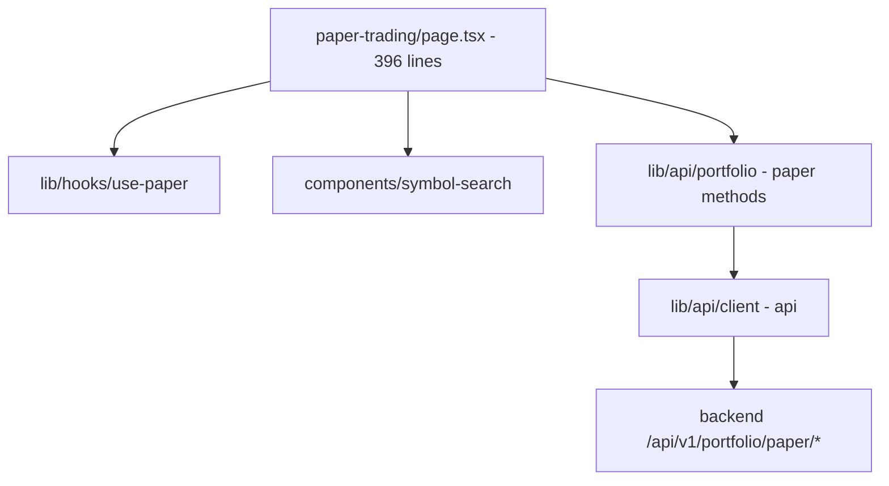
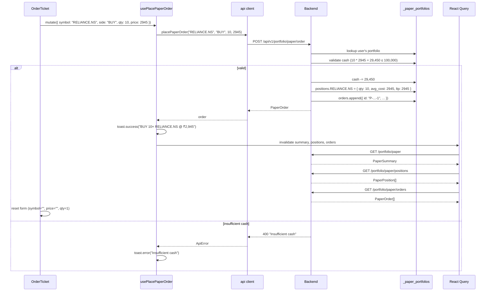

# Paper trading — implementation (reading the code)

A guide for someone with the repo open. The whole page is one file.

## File map



## 1. `frontend/app/(app)/app/paper-trading/page.tsx` (396 lines)

The page contains 4 components, all inline.

| Component | Purpose |
|---|---|
| `StatCard({ label, value, icon, tone })` | One small stat card |
| `OrderTicket()` | The buy/sell form |
| `PositionsTable()` | The list of open positions |
| `OrdersTable()` | The list of all orders |
| `PaperTradingPage` | The exported default |

## 2. `StatCard` (~25 lines)

A reusable stat card. Used 4 times in the summary grid.

```tsx
function StatCard({ label, value, icon, tone }) {
  return (
    <div className="rounded-lg border border-border bg-card p-4 text-center">
      <div className="mb-1 flex items-center justify-center gap-1.5 text-[10px] font-semibold uppercase tracking-wider text-muted-foreground">
        {icon}
        {label}
      </div>
      <div className={cn("font-mono text-lg font-bold tabular-nums", tone)}>{value}</div>
    </div>
  );
}
```

The label row has the icon and the metric name. The value is the
big mono number. The `tone` controls the value's text colour.

## 3. `OrderTicket` (~155 lines)

Already covered in `how-it-works.md`. Key parts:

### State

```typescript
const [symbol, setSymbol] = useState("");
const [side, setSide] = useState<"BUY" | "SELL">("BUY");
const [qty, setQty] = useState(1);
const [price, setPrice] = useState("");
```

### Estimated cost

```typescript
const estimatedCost = qty * (parseFloat(price) || 0);
```

The `parseFloat(price) || 0` handles the empty-string case (returns
0). When the price is empty, the estimated cost is 0.

### Submit

```typescript
const handleSubmit = () => {
  const p = parseFloat(price);
  if (!symbol || !p || qty <= 0) return;
  placeOrder.mutate(
    { symbol: symbol.trim().toUpperCase(), side, qty, price: p },
    {
      onSuccess: () => {
        setSymbol("");
        setPrice("");
        setQty(1);
      },
    },
  );
};
```

The form resets on success. The side is preserved (so the user can
place multiple orders on the same side quickly).

### Quick-pick chips

```typescript
{watchlistTickers.size > 0 && (
  <div className="flex flex-wrap gap-1">
    {Array.from(watchlistTickers).slice(0, 4).map((t) => (
      <button key={t} type="button" onClick={() => setSymbol(t)} className={cn(
        "rounded-md border px-1.5 py-0.5 font-mono text-[10px] transition-colors",
        symbol === t ? "border-ai bg-ai/10 text-ai" : "border-border text-muted-foreground hover:bg-muted",
      )}>
        {t.replace(".NS", "")}
      </button>
    ))}
  </div>
)}
```

The `Array.from(watchlistTickers)` converts the `Set<string>` to an
array. The `.slice(0, 4)` limits the display to the first 4 watchlist
tickers. The `t.replace(".NS", "")` strips the suffix for display.

## 4. `PositionsTable` (~50 lines)

Already covered. Key code:

```tsx
{positions.data.map((p) => (
  <div key={p.symbol} className="flex items-center justify-between rounded-lg border border-border px-4 py-3">
    <div>
      <span className="font-mono text-sm font-semibold">{p.symbol}</span>
      <span className="ml-2 text-xs text-muted-foreground">{p.qty} shares @ ₹{p.avg_cost.toLocaleString("en-IN")}</span>
    </div>
    <div className="text-right">
      <div className="font-mono text-xs">LTP ₹{p.ltp.toLocaleString("en-IN")}</div>
      <div className={cn("font-mono text-xs font-semibold", p.unrealised_pnl >= 0 ? "text-up" : "text-down")}>
        {p.unrealised_pnl >= 0 ? "+" : ""}₹{p.unrealised_pnl.toLocaleString("en-IN", { maximumFractionDigits: 2 })}
        <span className="ml-1 text-muted-foreground">({p.pnl_pct >= 0 ? "+" : ""}{p.pnl_pct.toFixed(2)}%)</span>
      </div>
    </div>
  </div>
))}
```

The `key={p.symbol}` is a code smell — using the symbol as the key
means React cannot reorder positions if the backend changes the order.
For a stable key, use a combination of `symbol + entry_date` (if
positions are ordered by entry time) or simply trust the backend's
order.

The `unrealised_pnl` is `qty × (ltp − avg_cost)`. The `pnl_pct` is
`(ltp − avg_cost) / avg_cost × 100`. Both are computed by the
backend.

## 5. `OrdersTable` (~50 lines)

Already covered. Key code:

```tsx
{orders.data.map((o) => (
  <div key={o.id} className="flex items-center justify-between rounded-lg border border-border px-4 py-3">
    <div className="flex items-center gap-3">
      <span className={cn("rounded-full px-2 py-0.5 font-mono text-[10px] font-semibold", o.type === "BUY" ? "bg-up/10 text-up" : "bg-down/10 text-down")}>
        {o.type}
      </span>
      <div>
        <span className="font-mono text-sm font-semibold">{o.symbol}</span>
        <span className="ml-2 text-xs text-muted-foreground">{o.qty} × ₹{o.price.toLocaleString("en-IN")}</span>
      </div>
    </div>
    <div className="text-right">
      <div className="font-mono text-xs font-semibold">₹{o.value.toLocaleString("en-IN", { maximumFractionDigits: 2 })}</div>
      <div className="font-mono text-[10px] text-muted-foreground">{o.id}</div>
    </div>
  </div>
))}
```

The `key={o.id}` is the order ID, which is unique. The `value` is
`qty × price`, precomputed by the backend.

## 6. `PaperTradingPage` (~80 lines)

The page composition. Already covered. Key parts:

### The summary

```tsx
{summary.isLoading ? (
  <Skeleton />
) : summary.data ? (
  <div className="grid grid-cols-2 gap-3 sm:grid-cols-4">
    <StatCard label="Cash" value={`₹${summary.data.cash.toLocaleString("en-IN")}`} icon={<Banknote className="size-3" />} />
    ...
  </div>
) : null}
```

3-column on `sm` and up, 2-column on mobile. The 4 cards show Cash,
Positions, Orders, Realised P&L.

### The header

```tsx
<div className="flex items-center justify-between">
  <h1 className="text-2xl font-semibold">Paper Trading</h1>
  <Button variant="ghost" size="sm" onClick={() => reset.mutate()} disabled={reset.isPending} className="text-xs text-muted-foreground">
    <RefreshCcw className="mr-1.5 size-3" />
    Reset
  </Button>
</div>
```

The title and the Reset button on the right. The button is disabled
while the mutation is in flight.

### The tabs

```tsx
<Tabs defaultValue="positions">
  <TabsList className="w-full">
    <TabsTrigger value="positions" className="flex-1">
      <Package className="mr-1.5 size-3.5" />
      Positions
    </TabsTrigger>
    <TabsTrigger value="orders" className="flex-1">
      <History className="mr-1.5 size-3.5" />
      Orders
    </TabsTrigger>
  </TabsList>
  <TabsContent value="positions"><PositionsTable /></TabsContent>
  <TabsContent value="orders"><OrdersTable /></TabsContent>
</Tabs>
```

Two tabs, full-width. Each tab renders the corresponding table.

## 7. The hooks

`frontend/lib/hooks/use-paper.ts` (80 lines). 5 hooks:

| Hook | Endpoint | Type |
|---|---|---|
| `usePaperSummary()` | `GET /portfolio/paper` | Query |
| `usePaperPositions()` | `GET /portfolio/paper/positions` | Query |
| `usePaperOrders()` | `GET /portfolio/paper/orders` | Query |
| `usePlacePaperOrder()` | `POST /portfolio/paper/order` | Mutation |
| `useResetPaper()` | `POST /portfolio/paper/reset` | Mutation |

All three queries have `staleTime: 0` (data is considered stale
immediately). This is intentional — paper trading is interactive and
the user expects fresh data.

The `usePlacePaperOrder` mutation's `onSuccess`:

```typescript
onSuccess: (order) => {
  toast.success(`${order.type} ${order.qty}× ${order.symbol} @ ₹${order.price.toLocaleString("en-IN")}`);
  qc.invalidateQueries({ queryKey: PAPER_KEYS.summary });
  qc.invalidateQueries({ queryKey: PAPER_KEYS.positions });
  qc.invalidateQueries({ queryKey: PAPER_KEYS.orders });
}
```

Three cache invalidations. The next render refetches all three.

The `useResetPaper` mutation does the same three invalidations.

## 8. The API types

`frontend/lib/api/portfolio.ts` (86 lines, but the paper methods are
~25 lines). The relevant types:

```typescript
export interface PaperSummary {
  cash: number;
  positions_count: number;
  orders_count: number;
  pnl: number;
  initial_cash: number;
}

export interface PaperOrder {
  id: string;
  ts: string;        // ISO timestamp
  symbol: string;
  type: string;      // "BUY" | "SELL"
  qty: number;
  price: number;
  value: number;     // qty * price
  mode: string;      // "paper" (always)
}

export interface PaperPosition {
  symbol: string;
  qty: number;
  avg_cost: number;
  ltp: number;
  unrealised_pnl: number;
  pnl_pct: number;
}
```

The P&L is **realised** in the summary and **unrealised** in
positions. The summary's P&L is the sum of closed trades. The
position's P&L is the current open trade's P&L.

## 9. End-to-end request trace — place a BUY order

You submit a BUY for 10 RELIANCE.NS at ₹2,945.00:



The success path is 1 POST + 3 GETs (the invalidation triggers
refetches). The error path is 1 POST + 1 toast.

## 10. Common gotchas

- **The paper portfolio does not persist across server restarts.** The
  in-memory dict is wiped on restart. The next request re-initialises
  the user's portfolio with ₹1,00,000.
- **The LTP is not live-updating.** The `usePaperPositions` hook does
  not poll. The LTP only updates on a new order. To make it live,
  add `refetchInterval: 30000` to the query.
- **SELL orders require holdings.** The backend returns 400 "Insufficient
  holding" if the SELL qty exceeds the held quantity.
- **The Reset button is irreversible.** There is no confirmation dialog.
  To add one, wrap the click in a `confirm(...)` or a modal.
- **The order ID is not a UUID.** It's `P-{timestamp}-{counter}`. The
  counter is per-user. Two orders in the same second can collide — but
  in practice, the counter is incremented after each order.
- **The form does not validate the price against the live market.** A
  user can place a BUY at ₹10,000 for a stock currently at ₹2,945.
  The order is accepted as-is. The LTP will diverge from the order
  price.
- **The position's `ltp` is the price at the last query, not the
  order's price.** When you BUY, the position is created with
  `ltp = order.price`. The LTP only changes when another query
  refreshes the positions (e.g. when you place another order).
- **The `toLocaleString("en-IN")` formatter** is used throughout for
  the Indian digit grouping (1,00,000 instead of 100,000).
- **The SELL button is not disabled when holdings are 0.** A user can
  click SELL with no holdings — the backend rejects with 400 "Insufficient
  holding" and a toast shows.
- **The watchlist quick-pick shows the first 4 only.** If you have
  20 watchlist tickers, only the first 4 are shown as chips. The
  ordering is the Set's iteration order (insertion order in most
  engines).

## Related

- Backend counterpart: [portfolio module](../../modules/portfolio/overview.md)
  — covers the paper trading service, the in-memory store, the
  weighted-avg cost, the cache invalidation.
- Sibling page: [backtest](../backtest/overview.md) — the strategy
  simulator is a different kind of "paper trading": it runs a fixed
  strategy on historical data, while this page is interactive.
- Parent page: [overview](overview.md).