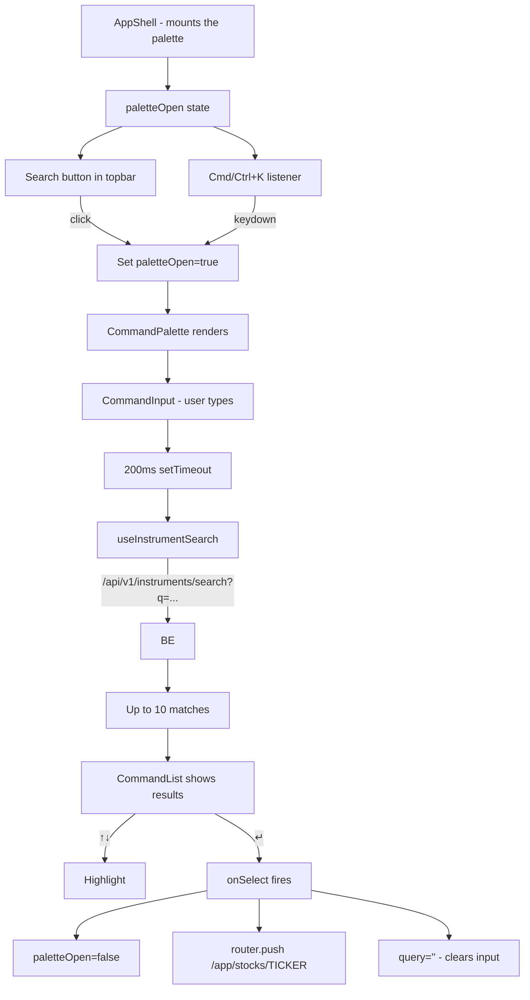

# Search — how it works

This page walks through the keyboard shortcut, the debounce, the
search pipeline, the navigation, and the empty states.

## The big picture



The palette is a controlled component. The shell holds the open
state. The palette fires `onOpenChange(false)` on close.

## The keyboard shortcut

```typescript
useEffect(() => {
  const onKeyDown = (e: KeyboardEvent) => {
    if (e.key === "k" && (e.metaKey || e.ctrlKey)) {
      e.preventDefault();
      onOpenChange(!open);
    }
  };
  document.addEventListener("keydown", onKeyDown);
  return () => document.removeEventListener("keydown", onKeyDown);
}, [open, onOpenChange]);
```

A `useEffect` registers a global `keydown` listener on `document`. When
the user presses `k` with `Cmd` (Mac) or `Ctrl` (Windows/Linux), the
palette toggles.

The `!open` flips the current state. So ⌘K opens, ⌘K again closes.

The cleanup `document.removeEventListener` removes the listener on
unmount.

The `e.preventDefault()` stops the browser's default `⌘K` behaviour
(chrome: focus the URL bar; safari: focus the search bar).

## The debounce

```typescript
const [query, setQuery] = useState("");
const [debounced, setDebounced] = useState("");

useEffect(() => {
  const t = setTimeout(() => setDebounced(query), 200);
  return () => clearTimeout(t);
}, [query]);
```

The input's `query` updates on every keystroke. The `debounced` value
is `query` after 200ms of no typing. The debounce prevents firing a
search request on every keystroke.

The cleanup `clearTimeout(t)` cancels the pending timeout if the user
types again before 200ms pass. This is the standard debounce pattern.

## The search pipeline

```typescript
const { data, isFetching } = useInstrumentSearch(debounced);
const results = useMemo(() => data?.results ?? [], [data]);
```

`useInstrumentSearch(q)` is a React Query hook that hits
`/api/v1/instruments/search?q={q}`. The backend's
`instruments.service.search_instruments` filters the
`instrument_master.json` file (646 NSE + BSE instruments + indices).

The default `limit` is 8 (from the hook's default). The search is
case-insensitive and matches both name and ticker.

The `useMemo` returns the same array reference between renders if
`data` hasn't changed — prevents unnecessary re-renders of the
`CommandList`.

## The select flow

```typescript
const select = useCallback(
  (ticker: string) => {
    onOpenChange(false);
    setQuery("");
    router.push(`/app/stocks/${encodeURIComponent(ticker)}`);
  },
  [onOpenChange, router],
);
```

When the user selects a result:
1. Close the modal (`onOpenChange(false)`).
2. Clear the input (`setQuery("")`).
3. Navigate to the stock terminal.

The `useCallback` memoises the function so the `CommandItem`'s
`onSelect` prop reference is stable.

The `encodeURIComponent` URL-encodes the ticker. `^NSEI` becomes
`%5ENSEI` (the `^` is percent-encoded). The stock terminal decodes
it on the server side.

## The result list

```tsx
<CommandList>
  {debounced && results.length === 0 && !isFetching && (
    <CommandEmpty>No match for "{debounced}".</CommandEmpty>
  )}
  {results.length > 0 && (
    <CommandGroup heading="Instruments">
      {results.map((r) => (
        <CommandItem
          key={r.ticker}
          value={`${r.name} ${r.ticker}`}
          onSelect={() => select(r.ticker)}
        >
          <TrendingUp className="size-4 text-muted-foreground" />
          <span className="flex-1 truncate">{r.name}</span>
          <span className="font-mono text-xs text-muted-foreground">{r.ticker}</span>
        </CommandItem>
      ))}
    </CommandGroup>
  )}
  {!debounced && (
    <div className="px-4 py-6 text-center text-sm text-muted-foreground">
      Type a name or ticker — NSE &amp; BSE instruments, plus indices.
    </div>
  )}
</CommandList>
```

Three states:

1. **No query**: show a hint "Type a name or ticker — NSE & BSE
   instruments, plus indices."
2. **Query, no results**: show "No match for 'xyz'."
3. **Query with results**: show the list under "Instruments" heading.

Each result has:
- A small `TrendingUp` icon (a visual indicator of "stock").
- The name (truncated if too long).
- The ticker (mono, muted, on the right).

The `value="${r.name} ${r.ticker}"` is what `cmdk` uses for keyboard
navigation. Pressing ↓ cycles through the items.

## The keyboard hints footer

```tsx
<div className="flex items-center gap-4 border-t border-border px-4 py-2 text-[11px] text-muted-foreground">
  <span className="flex items-center gap-1"><Search className="size-3" /> search</span>
  <span><kbd className="rounded border border-border px-1">↑↓</kbd> navigate</span>
  <span><kbd className="rounded border border-border px-1">↵</kbd> open terminal</span>
</div>
```

Three hints: search, navigate (↑↓), and open (↵). The `kbd` element
is a small monospaced key cap. The `border` class gives it the
squared look.

## The cmdk library

The palette uses `cmdk` (the Radix command menu). The components:

| Component | Purpose |
|---|---|
| `CommandDialog` | The modal wrapper |
| `CommandInput` | The search input |
| `CommandList` | The scrollable list of results |
| `CommandGroup` | A labelled group of items (e.g. "Instruments") |
| `CommandItem` | A single result |
| `CommandEmpty` | The "no results" message |

`cmdk` handles the keyboard navigation (↑↓ to highlight, ↵ to select,
Esc to close) and the accessibility (ARIA roles, focus management).

## The search button

In the topbar, there is a clickable search button:

```tsx
<button
  onClick={() => setPaletteOpen(true)}
  className="flex items-center gap-2 rounded-lg border border-border bg-card px-3 py-1.5 text-sm text-muted-foreground transition-colors hover:border-primary/40 hover:text-foreground md:w-80"
>
  <Search className="size-4" />
  <span>Search stocks…</span>
  <kbd className="ml-auto rounded border border-border px-1.5 text-[10px]">⌘K</kbd>
</button>
```

The button has:
- A search icon.
- A "Search stocks…" placeholder.
- A `⌘K` keyboard hint on the right (using `<kbd>`).

The width is `md:w-80` (320px on `md` and up, narrower on mobile —
the kbd hint is hidden on mobile to save space).

## What can go wrong

| Symptom | Cause |
|---|---|
| ⌘K does nothing | The user is not on a `/app/*` page. The palette is only mounted in the app shell. |
| Search returns no results for a valid ticker | The instruments JSON may be out of date. The ticker might be too new. |
| Search fires on every keystroke | The debounce is not working. Check the `useEffect` cleanup. |
| Search is slow | The backend's instrument search is in-memory. ~50ms typical. |
| Modal does not close on Esc | The cmdk library handles Esc. If it doesn't, the dialog wrapper is missing. |
| Modal stays open after navigation | The `onOpenChange(false)` is not firing. The state is not being updated. |
| Stale results after typing | React Query is caching the previous query. The query key changes on debounced value, so this should be fine. |
| ⌘K opens the browser's search bar | The `e.preventDefault()` is missing in the keydown handler. |

Related: [implementation](implementation.md) for the file map and the
request trace.