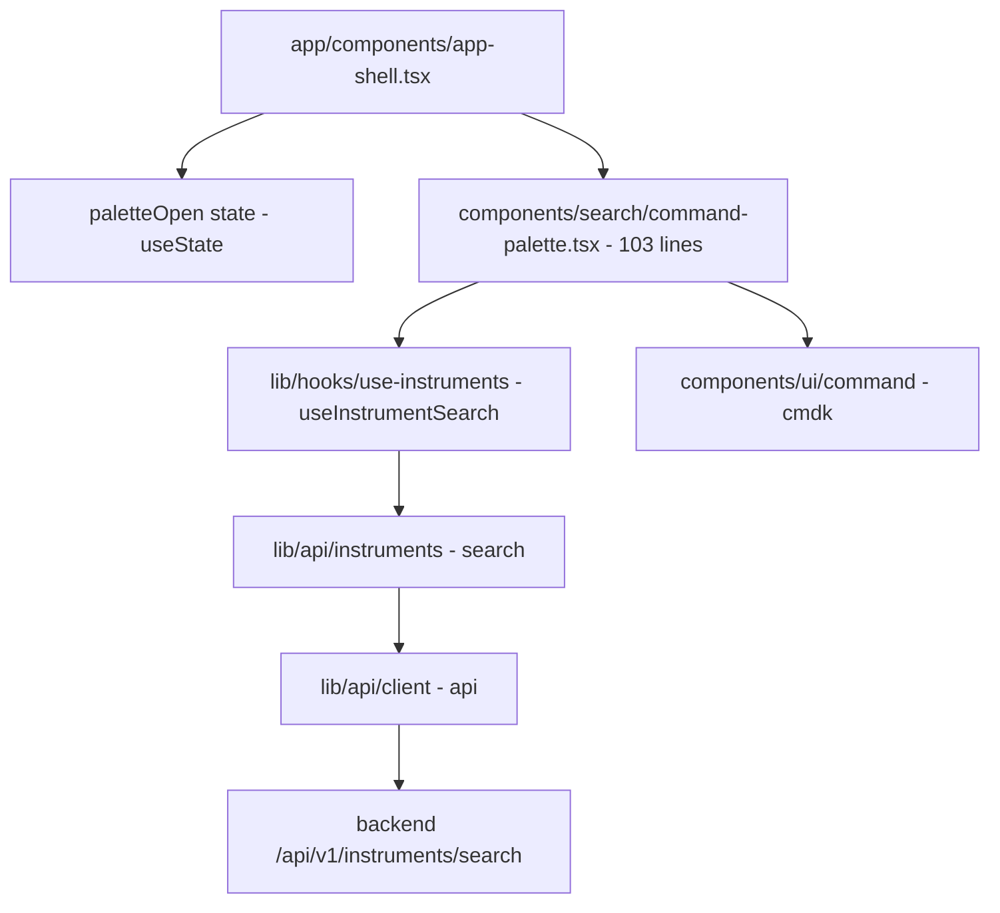
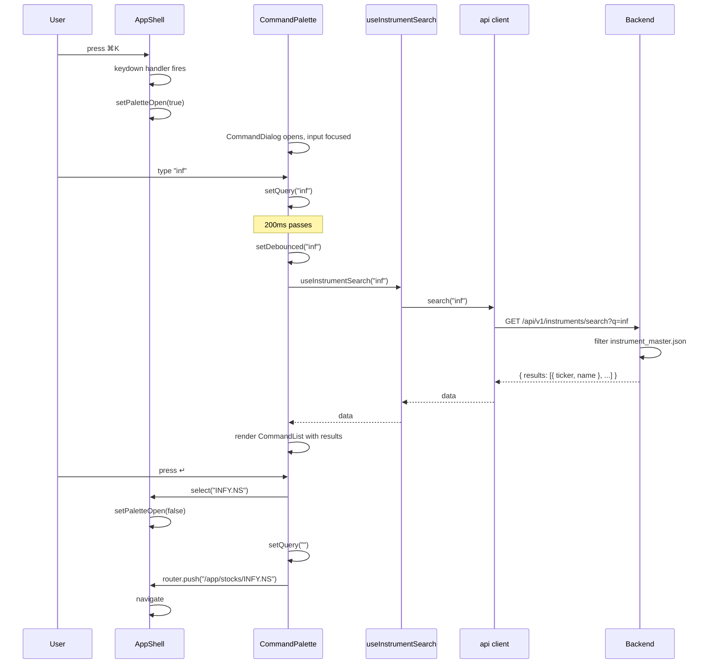

# Search — implementation (reading the code)

A guide for someone with the repo open.

## File map



## 1. The mounting point

The palette is mounted in `app-shell.tsx`, line 221:

```tsx
<CommandPalette open={paletteOpen} onOpenChange={setPaletteOpen} />
```

The shell holds the `paletteOpen` state:

```typescript
const [paletteOpen, setPaletteOpen] = useState(false);
```

The state is shared between:
- The search button in the topbar (which sets it to `true` on click).
- The palette itself (which sets it to `false` on close).

The keyboard listener for ⌘K is registered inside the palette
component, not in the shell. This is intentional — the listener is
only active when the palette is mounted (which is always, in the
app shell).

## 2. `components/search/command-palette.tsx` (103 lines)

The whole palette. Key parts:

### Imports

```typescript
import { useCallback, useEffect, useMemo, useState } from "react";
import { useRouter } from "next/navigation";
import { Search, TrendingUp } from "lucide-react";
import { CommandDialog, CommandEmpty, CommandGroup, CommandInput, CommandItem, CommandList } from "@/components/ui/command";
import { useInstrumentSearch } from "@/lib/hooks/use-instruments";
```

`useRouter` is from `next/navigation` (the App Router's hook). The
`command` primitives are from a local wrapper around `cmdk`.

### State

```typescript
const [query, setQuery] = useState("");
const [debounced, setDebounced] = useState("");
```

Two `useState` calls. `query` is the raw input, `debounced` is the
value after 200ms.

### Keyboard shortcut

```typescript
useEffect(() => {
  const onKeyDown = (e: KeyboardEvent) => {
    if (e.key === "k" && (e.metaKey || e.ctrlKey)) {
      e.preventDefault();
      onOpenChange(!open);
    }
  };
  document.addEventListener("keydown", onKeyDown);
  return () => document.removeEventListener("keydown", onKeyDown);
}, [open, onOpenChange]);
```

The `keydown` listener is global (on `document`). The dependency
array `[open, onOpenChange]` means the listener is re-registered when
these change. This is the standard pattern for `addEventListener` in
React.

`e.metaKey` is the Mac Cmd key. `e.ctrlKey` is the Windows/Linux Ctrl
key. The OR is for cross-platform support.

The `!open` toggles the state. The first ⌘K opens; the second
⌘K closes.

### Debounce

```typescript
useEffect(() => {
  const t = setTimeout(() => setDebounced(query), 200);
  return () => clearTimeout(t);
}, [query]);
```

200ms debounce. The `setTimeout` is cleared on every new `query`
change — so only the last keystroke in a 200ms window fires the
search.

### Search

```typescript
const { data, isFetching } = useInstrumentSearch(debounced);
const results = useMemo(() => data?.results ?? [], [data]);
```

`useInstrumentSearch(debounced)` fires when `debounced` changes.
The hook returns `{ data, isFetching, ... }`.

The `useMemo` is a small optimisation: the `results` array reference
is stable between renders if `data` doesn't change. This prevents
unnecessary re-renders of the `CommandList`.

### Select

```typescript
const select = useCallback(
  (ticker: string) => {
    onOpenChange(false);
    setQuery("");
    router.push(`/app/stocks/${encodeURIComponent(ticker)}`);
  },
  [onOpenChange, router],
);
```

`useCallback` memoises the function. The function:
1. Closes the palette.
2. Clears the input.
3. Navigates to the stock terminal.

The `encodeURIComponent` URL-encodes the ticker. `^NSEI` becomes
`%5ENSEI`.

### Render

```tsx
<CommandDialog open={open} onOpenChange={onOpenChange}>
  <CommandInput placeholder="Search stock or index… e.g. RELIANCE, TCS, Nifty" value={query} onValueChange={setQuery} />
  <CommandList>
    {debounced && results.length === 0 && !isFetching && (
      <CommandEmpty>No match for "{debounced}".</CommandEmpty>
    )}
    {results.length > 0 && (
      <CommandGroup heading="Instruments">
        {results.map((r) => (
          <CommandItem key={r.ticker} value={`${r.name} ${r.ticker}`} onSelect={() => select(r.ticker)}>
            <TrendingUp className="size-4 text-muted-foreground" />
            <span className="flex-1 truncate">{r.name}</span>
            <span className="font-mono text-xs text-muted-foreground">{r.ticker}</span>
          </CommandItem>
        ))}
      </CommandGroup>
    )}
    {!debounced && (
      <div className="px-4 py-6 text-center text-sm text-muted-foreground">
        Type a name or ticker — NSE &amp; BSE instruments, plus indices.
      </div>
    )}
  </CommandList>
  <div className="flex items-center gap-4 border-t border-border px-4 py-2 text-[11px] text-muted-foreground">
    <span className="flex items-center gap-1"><Search className="size-3" /> search</span>
    <span><kbd className="rounded border border-border px-1">↑↓</kbd> navigate</span>
    <span><kbd className="rounded border border-border px-1">↵</kbd> open terminal</span>
  </div>
</CommandDialog>
```

The dialog wraps the input, list, and footer. The `cmdk` primitives
handle the keyboard navigation and accessibility.

## 3. The search button

In `app-shell.tsx` (the topbar):

```tsx
<button onClick={() => setPaletteOpen(true)} className="...">
  <Search className="size-4" />
  <span>Search stocks…</span>
  <kbd className="ml-auto rounded border border-border px-1.5 text-[10px]">⌘K</kbd>
</button>
```

The button has:
- A search icon (left).
- A "Search stocks…" placeholder.
- A `⌘K` kbd hint (right).

The `ml-auto` pushes the kbd to the right. The `md:w-80` on the
parent makes the button 320px wide on `md` and up.

The button is hidden on mobile via `md:w-80` (the parent is the
search button container, not the button itself). On mobile, only the
search icon is shown (the text and kbd are hidden).

## 4. The hooks used

| Hook | Endpoint | Trigger |
|---|---|---|
| `useInstrumentSearch(q)` | `GET /instruments/search?q={q}` | `q` changes (after debounce) |

The hook has a default `limit` of 8. The command palette uses the
default.

## 5. The cmdk library

`@/components/ui/command.tsx` is a local wrapper around `cmdk`. The
primitives:

- `CommandDialog` — wraps `Dialog` (Radix) around the cmdk root.
- `CommandInput` — the search input.
- `CommandList` — the scrollable container for results.
- `CommandGroup` — a labelled group of items.
- `CommandItem` — a single result (a button).
- `CommandEmpty` — the "no results" message.

The library handles:
- Keyboard navigation (↑↓ to highlight, ↵ to select, Esc to close).
- ARIA roles (combobox, listbox, option).
- Focus management (the input is focused on open).

The wrapper at `@/components/ui/command.tsx` is a thin shim around
`cmdk` that adds Tailwind class names. The behaviour is unchanged.

## 6. End-to-end request trace — open and search

You press ⌘K and type "inf":



The search fires 200ms after the last keystroke. The result list
updates. The user selects with ↵. The page navigates.

## 7. Common gotchas

- **The palette is global.** It works on every `/app/*` page. It
  does not work on `/` (landing) or `/login`, `/register` (no app
  shell).
- **The keyboard shortcut conflicts with the browser's ⌘K.** On
  Chrome, ⌘K focuses the URL bar. The `e.preventDefault()` stops this.
  On Safari, ⌘K opens the search bar — also stopped.
- **The debounce is 200ms.** Lower feels snappy but fires too many
  requests. Higher feels laggy. 200ms is a good middle ground.
- **The `value` on CommandItem is `${r.name} ${r.ticker}`.** This is
  what `cmdk` uses for keyboard navigation. If two items have the
  same name (e.g. "Reliance Industries" on NSE and BSE), the
  ticker disambiguates.
- **The select function URL-encodes the ticker.** `^NSEI` becomes
  `%5ENSEI`. The stock terminal decodes it on the server side.
- **The state is not preserved across opens.** Each open starts with
  an empty `query` and `debounced`. There is no "recent searches"
  feature.
- **The palette is in the same React tree as the rest of the app.**
  This means it has access to the same `useQuery` cache. If the
  instruments list was prefetched elsewhere, the search would hit
  the cache.
- **The `useCallback` for `select`** depends on `[onOpenChange, router]`.
  If the parent component re-renders with a new function reference,
  the callback is recreated. This is fine — the only consumers are
  the `CommandItem` `onSelect` props, which are passed once per item.
- **The `onKeyDown` listener is re-registered on every `open` change.**
  This is because of the `[open, onOpenChange]` dependency array. The
  cost is one add/remove cycle per open. Negligible.
- **The keyboard listener is on `document`, not the input.** This
  means the shortcut works even when the input is not focused. The
  user can press ⌘K from anywhere in the app.

## Related

- Backend counterpart: [instruments module](../../modules/instruments/overview.md) — covers
  the search endpoint, the JSON master, the @lru_cache.
- Sibling "page": mounted in [app-shell](../dashboard/implementation.md) — the topbar
  component.
- Used by: every page that needs an instrument (compare, backtest,
  paper-trading, alerts, markets NSE Quote).
- Parent page: [overview](overview.md).