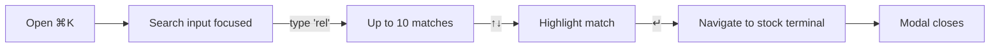

# Search — what it is

The Search page is the **command palette**, a global overlay that lets
you jump to any NSE/BSE stock or index from anywhere in the app.
It is **not** a URL-based page — there is no `/app/search` route. It
is a modal that opens on top of whatever page you are on.

The keyboard shortcut to open it is **⌘K** (Mac) or **Ctrl+K**
(Windows/Linux). You can also click the search button in the topbar
of any `/app/*` page.

This is the global navigation primitive. From anywhere in the app, two
keystrokes take you to any stock's terminal.

## What visitors see

A centred dialog at the top of the screen with:

- A large search input with a magnifying glass icon.
- A list of matching instruments (up to ~10).
- A small footer with keyboard hints: search, ↑↓ to navigate, ↵ to open.

The modal uses the `cmdk` (Command palette) library for the input
behaviour. The results are powered by the same
`/api/v1/instruments/search` endpoint that the markets NSE Quote tab
and the backtest form use.

## A real example

You are on the dashboard. You press ⌘K. The modal opens.

You type "inf". After 200ms (the debounce delay), the search fires.
Up to 10 results appear:

- **Infosys** — `INFY.NS`
- **Infosys (ADR)** — `INFY` (BSE)
- **Interglobe Aviation** — `INDIGO.NS`
- ...

You press ↓ once to highlight "Infosys". Press ↵. The modal closes.
The page navigates to `/app/stocks/INFY.NS` (the stock terminal).

Total visible delay: ~250ms (200ms debounce + 50ms search).

## What you can search for

- **NSE stocks**: e.g. "RELIANCE", "TCS", "INFY", "HDFCBANK".
- **BSE stocks**: e.g. "RELIANCE" (without `.NS`, the search returns
  both exchanges).
- **Indices**: e.g. "NIFTY", "SENSEX", "BANKNIFTY".
- **Partial names**: "Reli" matches "Reliance Industries", "Reliance
  Communications", etc.
- **Partial tickers**: "HDF" matches "HDFCBANK.NS", "HDFCAMC.NS",
  "HDFCLIFE.NS", etc.

The search is **case-insensitive** and matches both name and ticker.

## A real example: searching for an index

You press ⌘K and type "nifty". The results include all the Nifty
indices:

- **NIFTY 50** — `^NSEI`
- **NIFTY BANK** — `^NSEBANK`
- **NIFTY IT** — `^CNXIT`
- ...

You press ↓ to highlight "NIFTY 50". Press ↵. The page navigates to
`/app/stocks/%5ENSEI` (URL-encoded `^NSEI`). The stock terminal
shows the index's data (with the exchange badge showing "INDEX").

## When is the palette not available?

The palette is only available in the **app shell** (`/app/*` pages).
The landing page (`/`) and the auth pages (`/login`, `/register`) do
not have the palette — they have no use for it.

The palette is also **disabled** when the user is not logged in. The
`RequireAuth` wrapper ensures the shell only renders for logged-in
users.

## What the palette does not do

- **It does not search news, alerts, or paper orders.** Just
  instruments.
- **It does not support actions like "Go to alerts".** It only
  navigates to the stock terminal. To go to alerts, use the sidebar
  nav.
- **It does not remember your recent searches.** Each open is a fresh
  search.
- **It does not show a "no results" message** if your query is too
  short (less than 2 characters). The "no results" message only shows
  when the search returned empty results.

## Where it lives in the codebase

- Component: `frontend/components/search/command-palette.tsx` (103 lines)
- Mounted in: `frontend/app/(app)/app/components/app-shell.tsx` (line 221)
- Hook: `useInstrumentSearch` from `frontend/lib/hooks/use-instruments.ts`
- Library: `cmdk` (Radix UI) — `CommandDialog`, `CommandInput`,
  `CommandList`, `CommandItem`, `CommandGroup`, `CommandEmpty`

The palette is mounted in the app shell's topbar, not in the page
content. This means it is available on every `/app/*` page without
the page needing to know about it.

## Backend modules used

- [Instruments](../../modules/instruments/overview.md) — the only module. The palette
  calls `GET /instruments/search?q=...` (debounced 200ms).

## Related pages in this folder

- [How it works](how-it-works.md) — the keyboard shortcut, the
  debounce, the search pipeline, the navigation, the empty states.
- [Implementation](implementation.md) — file map, the cmdk usage,
  the keyboard handler, the routing, the request trace.