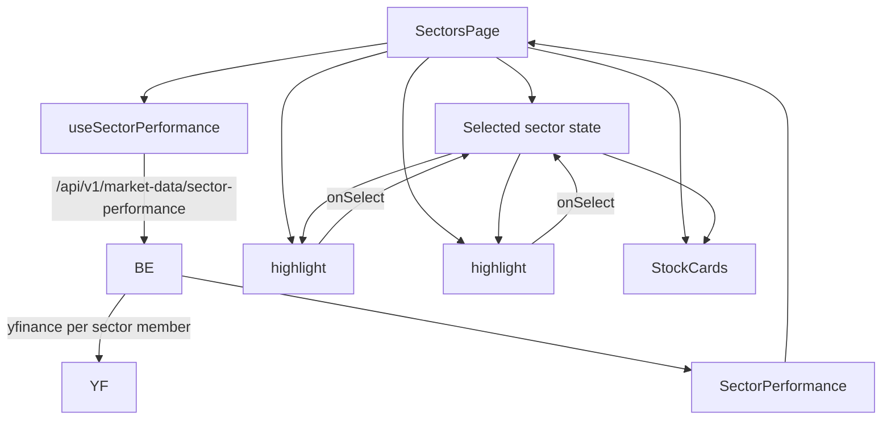

# Sectors — how it works

This page walks through the data flow, the treemap algorithm, the colour
intensity, the performance bars, the stock cards, and the selection state.

## The big picture



One backend call, three client components. The selection state is shared
between them.

## The data

`useSectorPerformance()` returns:

```typescript
{
  sectors: [
    {
      name: "IT",
      change_pct: 2.1,
      stocks: [
        { ticker: "INFY.NS", label: "Infosys", mcap: 750000, change_pct: 2.8 },
        { ticker: "TCS.NS", label: "TCS", mcap: 1500000, change_pct: 1.9 },
        ...
      ],
    },
    {
      name: "Pharma",
      change_pct: -1.2,
      stocks: [...],
    },
    ...
  ]
}
```

Each sector has a name, a % change for the day, and a list of its Nifty 50
members with their individual % changes and market caps.

The backend's `market_data.router` exposes the
`/api/v1/market-data/sector-performance` endpoint, which iterates the
Nifty 50 tickers, groups them by sector, fetches each ticker's % change
(via yfinance), and aggregates.

## The treemap

`sector-treemap.tsx` (216 lines). The most complex component on the page.

### What is a treemap?

A treemap is a visualisation that maps a list of values into nested
rectangles. Each rectangle's area is proportional to its value. The
"squarified" algorithm (Bruls et al., 2000) keeps the rectangles
near-square rather than long-thin strips, which makes the labels
readable.

### The algorithm

```typescript
function squarify(values, x0, y0, width, height): Rect[] {
  const total = values.reduce((a, b) => a + b, 0);
  if (total <= 0) return [];

  // Scale each value to its area in pixels.
  const scaled = values.map((v) => (v / total) * width * height);
  let remaining = [...scaled];
  let x = x0, y = y0, w = width, h = height;

  while (remaining.length > 0) {
    const side = Math.min(w, h);

    // Greedy row: add the next value if it improves the worst aspect ratio.
    const row: number[] = [remaining[0]];
    remaining = remaining.slice(1);
    while (remaining.length > 0 && worst([...row, remaining[0]], side) <= worst(row, side)) {
      row.push(remaining[0]);
      remaining = remaining.slice(1);
    }

    // Lay out the row along the shorter side.
    const rowSum = row.reduce((a, b) => a + b, 0);
    const thickness = rowSum / side;
    let offset = 0;
    for (const item of row) {
      const size = item / thickness;
      if (w >= h) rects.push({ x, y: y + offset, w: thickness, h: size });
      else rects.push({ x: x + offset, y, w: size, h: thickness });
      offset += size;
    }

    // Shrink the remaining area.
    if (w >= h) { x += thickness; w -= thickness; }
    else { y += thickness; h -= thickness; }
  }
  return rects;
}
```

Three steps in a loop:

1. **Pick a row** — start with the first value, then greedily add more
   values while the row's worst aspect ratio improves.
2. **Lay out the row** — give the row a thickness along the shorter side
   of the remaining area, and stack rectangles along the longer side.
3. **Shrink the area** — remove the laid-out row from the remaining
   area, then repeat with the new (smaller, possibly wider or taller)
   area.

The "worst aspect ratio" of a row is the maximum of `(side² × max) / sum²`
and `sum² / (side² × min)`. This is the Bruls formula.

### The colour

```typescript
function changeFill(pct: number | null) {
  if (pct === null || pct === 0) {
    return { color: "var(--muted-foreground)", opacity: 0.18 };
  }
  const intensity = Math.min(Math.abs(pct) / 2, 1) * 0.45 + 0.15;
  return {
    color: pct > 0 ? "var(--up)" : "var(--down)",
    opacity: intensity,
  };
}
```

- `null` or 0 → muted grey, 18% opacity.
- Positive → emerald (`--up`).
- Negative → red (`--down`).
- Opacity scales with magnitude: `|pct| / 2`, clamped to [0, 1], then
  scaled to [0.15, 0.60]. A 2% move gives 60% opacity; 4% gives 60% (capped).

The CSS variables (`--up`, `--down`, `--muted-foreground`) come from the
theme. They swap on theme change.

### Container-aware sizing

```typescript
function useElementWidth<T extends HTMLElement>() {
  const ref = useRef<T>(null);
  const [width, setWidth] = useState(0);
  useEffect(() => {
    const el = ref.current;
    if (!el) return;
    const ro = new ResizeObserver((entries) => {
      setWidth(entries[0]?.contentRect.width ?? 0);
    });
    ro.observe(el);
    return () => ro.disconnect();
  }, []);
  return { ref, width };
}
```

A custom hook that measures the container's width with a
`ResizeObserver`. The treemap layout is recomputed when the width
changes (e.g. on window resize, on sidebar toggle, on orientation
change).

The cleanup `ro.disconnect()` releases the observer on unmount.

### Block selection

```typescript
<rect
  ...
  stroke={selected === r.name ? "var(--primary)" : "transparent"}
  strokeWidth={selected === r.name ? 2 : 0}
  rx={8}
  className={cn(
    "cursor-pointer transition-opacity duration-150 hover:opacity-90",
    selected && selected !== r.name && "opacity-40",
  )}
  onClick={() => onSelect(r.name)}
>
  <title>{`${r.name} — ...`}</title>
</rect>
```

- The selected block has a 2px primary-coloured stroke.
- The non-selected blocks (when something is selected) are dimmed to 40%
  opacity.
- Hover lifts the opacity to 90% (smooth transition).
- Click fires `onSelect(name)`.
- The `<title>` element is the SVG-native tooltip — it shows on hover.

### Label visibility

```typescript
const showLabel = r.w > 110 && r.h > 64;
const showPct = r.w > 110 && r.h > 84;
```

Small blocks hide their labels. The threshold is 110×64 for the sector
name and 110×84 for the percentage. Below these sizes, the text would
overflow or be unreadable.

### The legend

```tsx
<div className="mt-2.5 flex items-center justify-center gap-2 font-mono text-[10px] text-muted-foreground">
  <span>-2%</span>
  <span className="h-2 w-28 rounded-full bg-gradient-to-r from-down via-gold to-up" />
  <span>+2%</span>
  <span className="ml-2 flex items-center gap-1 normal-case">block size <InfoTip>...</InfoTip></span>
</div>
```

A gradient bar from red (-2%) through gold (0%) to green (+2%). An
InfoTip explains that block size = total market cap.

## The performance bars

`PerformanceBars` is a local component in `page.tsx`. It shows the same
sectors as the treemap, but as horizontal bars.

```typescript
const maxAbs = Math.max(...sectors.map((s) => Math.abs(s.change_pct ?? 0)), 0.01);
const width = (Math.abs(pct) / maxAbs) * 50;  // half-width each side
```

Each bar extends from the centre to the left (for losses) or right (for
gains). The maximum width is 50% of the bar's container — so the bar
fits in a half. The `maxAbs` normalises all bars to the same scale: the
biggest absolute move fills 50% of the row.

`0.01` is the minimum to prevent division by zero.

### The sort

```typescript
{[...sectors].sort((a, b) => (b.change_pct ?? 0) - (a.change_pct ?? 0)).map(...)}
```

The sectors are sorted descending by % change. The best performer is at
the top, the worst at the bottom. The spread makes a copy so the
original `sectors` array is not mutated.

### The bar rendering

```typescript
<span className="relative flex h-4 flex-1 items-center">
  <span aria-hidden className="absolute left-1/2 h-full w-px bg-border" />
  <span
    className={cn("absolute h-2 rounded-sm transition-all duration-300", up ? "left-1/2 bg-up" : "right-1/2 bg-down")}
    style={{ width: `${width}%` }}
  />
</span>
```

A flex container with a 1px centre notch. The bar starts at the centre
and extends left or right based on the sign. The transition makes the
bar animate when the data changes.

## The stock cards

`StockCards` is a local component. For the selected sector, it shows the
sector's members as paged cards.

### The filter

```typescript
const [query, setQuery] = useState("");
const [page, setPage] = useState(0);
const debounced = useDebouncedValue(query.trim().toLowerCase(), SEARCH_MS);

const filtered = useMemo(
  () => stocks.filter((s) => !debounced || s.label.toLowerCase().includes(debounced) || s.ticker.toLowerCase().includes(debounced)),
  [stocks, debounced]
);
```

The filter searches both the label (e.g. "Infosys") and the ticker
(e.g. "INFY.NS"). The debounce is 300ms.

### The pagination

```typescript
const pageCount = Math.max(1, Math.ceil(filtered.length / STOCKS_PER_PAGE));
const safePage = Math.min(page, pageCount - 1);
const pageStocks = filtered.slice(safePage * STOCKS_PER_PAGE, (safePage + 1) * STOCKS_PER_PAGE);
```

6 stocks per page. Standard clamping. The pager is at the bottom of the
card.

### Each card

```tsx
<Link
  key={s.ticker}
  href={`/app/stocks/${encodeURIComponent(s.ticker)}`}
  className="group flex items-center justify-between gap-3 rounded-xl border border-border bg-card px-4 py-3 transition-colors hover:border-primary/40"
>
  <div className="min-w-0">
    <p className="truncate text-sm font-medium">{s.label}</p>
    <p className="mt-0.5 font-mono text-[11px] text-muted-foreground">
      {s.ticker.replace(".NS", "")} · ₹{s.mcap.toLocaleString("en-IN")} Cr cap
    </p>
  </div>
  <div className="flex shrink-0 items-center gap-2">
    <span className={cn("rounded-full border px-2 py-0.5 font-mono text-[11px] font-semibold", toneBadgeClass[up ? "up" : "down"])}>
      {formatPct(s.change_pct)}
    </span>
    <ChevronRight className="size-4 text-muted-foreground/50 transition-transform group-hover:translate-x-0.5 group-hover:text-foreground" />
  </div>
</Link>
```

A card with:
- The stock name (e.g. "Infosys").
- The ticker (without `.NS`) and the market cap in crores.
- A coloured badge with the % change.
- A chevron that slides right on hover.

Clicking the card navigates to `/app/stocks/{ticker}` (the stock
terminal).

## The selection state

```typescript
const [selected, setSelected] = useState<string | null>(null);
const sectors = data?.sectors ?? [];
const active = selected && sectors.some((s) => s.name === selected) ? selected : (sectors[0]?.name ?? null);
const activeSector = sectors.find((s) => s.name === active);
```

`selected` is the user's pick. `active` is the effective selection — it
falls back to the first sector if `selected` is null or the selected
sector is not in the data (e.g. data was reloaded).

The `sectors.some(...)` check protects against a stale selection. If the
data was reloaded and the previously-selected sector is gone, `active`
falls back to the first available sector.

## What can go wrong

| Symptom | Cause |
|---|---|
| Treemap shows but no labels | The blocks are too small. The label visibility threshold is 110×64. The sector has very few members. |
| Treemap is empty | All sectors have no stocks. The filter `s.stocks.length > 0` removes them. |
| Performance bars are tiny | The biggest move is very small (e.g. < 0.1%). The 0.01 minimum normalises against this. |
| Stock cards show "No stocks match …" | The filter doesn't match any stock. Clear the filter. |
| Stock cards are missing some members | The data only includes Nifty 50 members. Non-Nifty 50 stocks are not shown. |
| Sector data unavailable | The backend's market-data module failed. The page shows the error state with a Retry button. |
| Selection doesn't update | The `sectors.some(...)` check rejected the selection. The data was reloaded. |
| Treemap is squished | The container is very narrow. The 110px label threshold may be too wide. |
| Treemap is tall and skinny | The container is wide but the height is fixed at 360px. The squarify algorithm still works but the blocks are tall. |

Related: [implementation](implementation.md) for the file map and the
request traces.