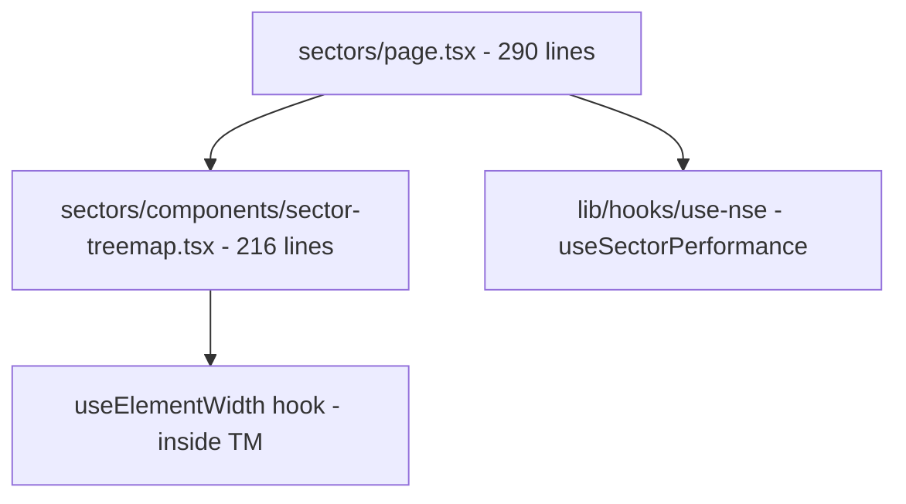
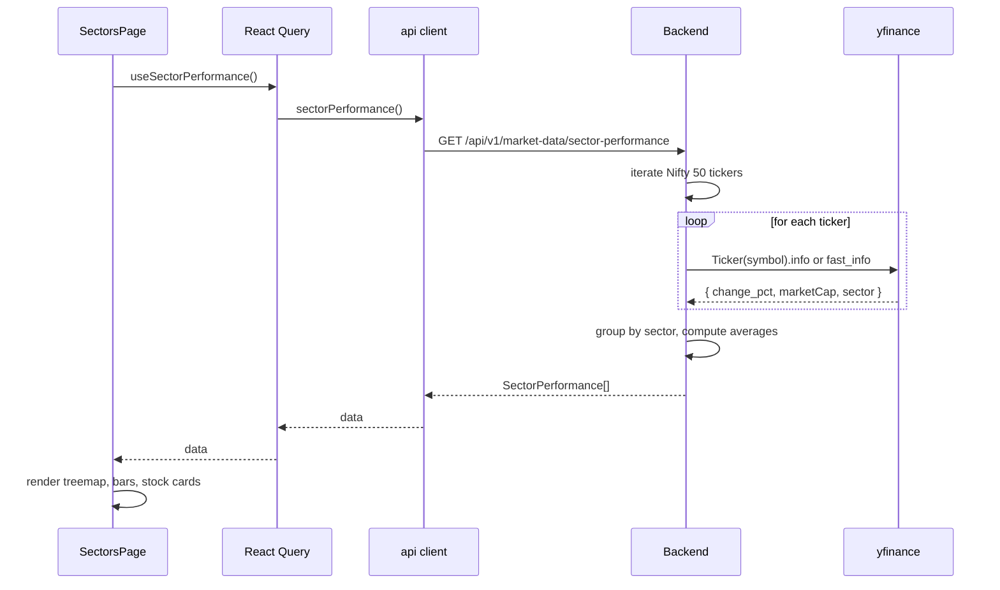

# Sectors — implementation (reading the code)

A guide for someone with the repo open. Read the files in this order.

## File map



## 1. `frontend/app/(app)/app/sectors/page.tsx` (290 lines)

The page itself. Already covered in `how-it-works.md`. The file has four
top-level components:

| Component | Purpose |
|---|---|
| `PerformanceBars` | Sorted horizontal bar list (inline in page.tsx) |
| `StockCards` | Paged cards with filter (inline in page.tsx) |
| `SectorsPage` | The page composition |

### Key code: selection

```typescript
const [selected, setSelected] = useState<string | null>(null);
const sectors = data?.sectors ?? [];
const active = selected && sectors.some((s) => s.name === selected) ? selected : (sectors[0]?.name ?? null);
const activeSector = sectors.find((s) => s.name === active);
```

The selection state is a `useState<string | null>`. `active` is the
effective selection (with fallback). `activeSector` is the sector object
for the active selection, or undefined if no sectors exist.

### Key code: layout

```tsx
<div className="grid gap-4 lg:grid-cols-5">
  <div className="lg:col-span-2">
    <PerformanceBars sectors={sectors} selected={active} onSelect={setSelected} />
  </div>
  <div className="lg:col-span-3">
    {activeSector ? <StockCards sectorName={activeSector.name} stocks={activeSector.stocks} /> : null}
  </div>
</div>
```

On `lg` screens and up, the bottom row is 5 columns wide: 2 for the bars,
3 for the cards. On smaller screens, they stack.

### Key code: StockCards filter

```typescript
const debounced = useDebouncedValue(query.trim().toLowerCase(), SEARCH_MS);
const filtered = useMemo(
  () => stocks.filter((s) => !debounced || s.label.toLowerCase().includes(debounced) || s.ticker.toLowerCase().includes(debounced)),
  [stocks, debounced]
);
```

`SEARCH_MS = 300`. The filter is a `useMemo` so it only recomputes when
`stocks` or `debounced` changes.

### Key code: pagination reset

```typescript
onChange={(e) => {
  setQuery(e.target.value);
  setPage(0);  // reset to first page on filter change
}}
```

Same pattern as the markets options tab: changing the filter resets the
page so the user does not end up on an empty page.

### Key code: card link

```typescript
<Link href={`/app/stocks/${encodeURIComponent(s.ticker)}`} ...>
```

The ticker is URL-encoded. `INFY.NS` becomes `INFY%2ENS`. The stock
terminal decodes it on the server side.

### Key code: market cap formatting

```typescript
{s.ticker.replace(".NS", "")} · ₹{s.mcap.toLocaleString("en-IN")} Cr cap
```

`toLocaleString("en-IN")` formats the number with Indian digit grouping
(commas at the 3-3-2 pattern: 7,50,000 instead of 750,000). The `.NS` is
stripped from the ticker for display. The "Cr" suffix means "crore" (1
crore = 10 million).

## 2. `frontend/app/(app)/app/sectors/components/sector-treemap.tsx` (216 lines)

The treemap. The most complex component on the page.

### Top-level functions

| Function | Purpose |
|---|---|
| `worst(row, side)` | The Bruls aspect-ratio formula |
| `squarify(values, x0, y0, w, h)` | The layout algorithm |
| `changeFill(pct)` | Maps % change to colour + opacity |
| `useElementWidth()` | Custom hook for container width |
| `SectorTreemap` | The exported component |

### The squarify algorithm

Already covered in `how-it-works.md`. Key code:

```typescript
function worst(row: number[], side: number): number {
  const sum = row.reduce((a, b) => a + b, 0);
  const max = Math.max(...row);
  const min = Math.min(...row);
  const s2 = sum * sum;
  const l2 = side * side;
  return Math.max((l2 * max) / s2, s2 / (l2 * min));
}
```

The aspect ratio of a row of items is the worst (largest) ratio among
all items in the row. The formula comes from Bruls et al. — it
penalises both very-tall-and-thin and very-wide-and-flat rectangles.

```typescript
function squarify(values, x0, y0, width, height): Rect[] {
  const total = values.reduce((a, b) => a + b, 0);
  if (total <= 0) return [];

  const scaled = values.map((v) => (v / total) * width * height);
  let remaining = [...scaled];
  let x = x0, y = y0, w = width, h = height;

  while (remaining.length > 0) {
    const side = Math.min(w, h);
    const row: number[] = [remaining[0]];
    remaining = remaining.slice(1);
    while (remaining.length > 0 && worst([...row, remaining[0]], side) <= worst(row, side)) {
      row.push(remaining[0]);
      remaining = remaining.slice(1);
    }

    const rowSum = row.reduce((a, b) => a + b, 0);
    const thickness = rowSum / side;
    let offset = 0;
    for (const item of row) {
      const size = item / thickness;
      if (w >= h) rects.push({ x, y: y + offset, w: thickness, h: size });
      else rects.push({ x: x + offset, y, w: size, h: thickness });
      offset += size;
    }

    if (w >= h) { x += thickness; w -= thickness; }
    else { y += thickness; h -= thickness; }
  }
  return rects;
}
```

The greedy loop: build a row by adding values while the aspect ratio
improves. Lay out the row along the shorter side. Shrink the remaining
area. Repeat.

### The colour

```typescript
function changeFill(pct: number | null) {
  if (pct === null || pct === 0) {
    return { color: "var(--muted-foreground)", opacity: 0.18 };
  }
  const intensity = Math.min(Math.abs(pct) / 2, 1) * 0.45 + 0.15;
  return {
    color: pct > 0 ? "var(--up)" : "var(--down)",
    opacity: intensity,
  };
}
```

`pct > 0` → emerald, `pct < 0` → red, `pct === 0` or `null` → muted grey.
Opacity is `(min(|pct|/2, 1) * 0.45) + 0.15` — so a 0% move has 15%
opacity and a 2% move has 60% opacity. Capped at 60%.

The CSS variables are read from `:root` (the theme). `--up` and `--down`
are defined in `globals.css`.

### Container width

```typescript
function useElementWidth<T extends HTMLElement>() {
  const ref = useRef<T>(null);
  const [width, setWidth] = useState(0);
  useEffect(() => {
    const el = ref.current;
    if (!el) return;
    const ro = new ResizeObserver((entries) => {
      setWidth(entries[0]?.contentRect.width ?? 0);
    });
    ro.observe(el);
    return () => ro.disconnect();
  }, []);
  return { ref, width };
}
```

A `ResizeObserver` watches the container's width. When it changes (e.g.
on window resize, on sidebar toggle, on orientation change), the
`setWidth` fires and the treemap re-layouts.

`useRef<T>(null)` is typed for any HTML element. The treemap uses
`<div ref={ref}>`, so `T = HTMLDivElement`.

The cleanup `ro.disconnect()` releases the observer on unmount.

### The layout memo

```typescript
const layout = useMemo(() => {
  if (width <= 0) return [];
  const usable = sectors.filter((s) => s.stocks.length > 0);
  const values = usable.map((s) => s.stocks.reduce((sum, st) => sum + st.mcap, 0));
  const coords = squarify(values, 0, 0, width, TREEMAP_HEIGHT);
  return coords.map((rect, i) => ({
    name: usable[i].name,
    changePct: usable[i].change_pct,
    mcap: values[i],
    ...rect,
  }));
}, [sectors, width]);
```

The memo recomputes when `sectors` or `width` changes. The filter
removes sectors with no stocks (these would not have a value and would
break the layout). The values are the total market cap of each sector's
members.

`TREEMAP_HEIGHT = 360` is the fixed height in pixels. The width is the
measured container width.

### The SVG render

```tsx
<svg
  viewBox={`0 0 ${Math.max(width, 1)} ${TREEMAP_HEIGHT}`}
  width="100%"
  height={TREEMAP_HEIGHT}
  className="block w-full rounded-xl border border-border bg-muted/30"
  role="img"
  aria-label="Sector treemap sized by market cap, coloured by change"
>
  {layout.map((r) => {
    const fill = changeFill(r.changePct);
    const showLabel = r.w > 110 && r.h > 64;
    const showPct = r.w > 110 && r.h > 84;
    return (
      <g key={r.name}>
        <rect
          x={r.x + 1}
          y={r.y + 1}
          width={Math.max(r.w - 2, 0)}
          height={Math.max(r.h - 2, 0)}
          fill={fill.color}
          fillOpacity={fill.opacity}
          stroke={selected === r.name ? "var(--primary)" : "transparent"}
          strokeWidth={selected === r.name ? 2 : 0}
          rx={8}
          className={cn(
            "cursor-pointer transition-opacity duration-150 hover:opacity-90",
            selected && selected !== r.name && "opacity-40",
          )}
          onClick={() => onSelect(r.name)}
        >
          <title>{`${r.name} — ${r.changePct !== null ? `${r.changePct > 0 ? "+" : ""}${r.changePct}% today` : "no change data"} (click to see stocks)`}</title>
        </rect>
        {showLabel ? (
          <text x={r.x + 12} y={r.y + 22} fontSize={13} fontWeight={600} className="pointer-events-none fill-foreground">
            {r.name}
          </text>
        ) : null}
        {showPct ? (
          <text
            x={r.x + 12}
            y={r.y + 40}
            fontSize={12}
            style={{ fontFamily: "var(--font-mono)", fill: (r.changePct ?? 0) >= 0 ? "var(--up-strong)" : "var(--down)" }}
            className="pointer-events-none"
          >
            {r.changePct !== null ? `${r.changePct > 0 ? "+" : ""}${r.changePct}%` : ""}
          </text>
        ) : null}
      </g>
    );
  })}
</svg>
```

Each block is a `<g>` (SVG group) containing a `<rect>` and optional
`<text>` elements. The rect has a 1px inset (`x={r.x + 1}`, `width={r.w - 2}`)
to leave a small gap between blocks. The `rx={8}` rounds the corners.

The labels (`<text>`) are hidden when the block is too small. The
threshold is 110×64 for the name, 110×84 for the percentage.

The `<title>` element provides a native SVG tooltip on hover. It's the
aria-accessible label.

The click handler `onClick={() => onSelect(r.name)}` calls the parent
component's setter. The parent (`SectorsPage`) updates the `selected`
state, which flows back as a prop.

## 3. The hooks used

| Hook | Endpoint |
|---|---|
| `useSectorPerformance()` | `GET /market-data/sector-performance` |
| `useDebouncedValue(value, ms)` | (no API) — local hook |

The sector performance endpoint returns a 60s cached response. Refresh
behaviour: the page re-fetches when remounted, when the React Query
cache expires, or when the user clicks Retry.

## 4. End-to-end request trace — first visit

You open `/app/sectors`:



One API call. The backend's Nifty 50 ticker list is iterated in
sequence. The full call takes 3–8 seconds depending on yfinance
response time. There is no per-ticker caching today — the entire
response is cached for 60s.

## 5. Common gotchas

- **The treemap is recomputed on every width change.** The `useMemo`
  runs whenever the container width changes. This includes the initial
  render (when `width` is still 0, returns empty array) and the first
  measured width (when `useEffect` fires and `setWidth` runs).
- **The initial render is empty.** The `width <= 0` guard means the
  first render is an empty layout. The `useEffect` runs after mount,
  the `ResizeObserver` fires with the actual width, and the treemap
  populates. This causes a brief flash of empty SVG.
- **The layout is per-render.** The squarify algorithm is pure and
  deterministic for the same inputs, so the memoization is safe.
- **The selected block's stroke is 2px.** This is added to the block's
  dimensions, so the visual size of the selected block is slightly
  larger than the unselected ones. To avoid this, you could render the
  stroke outside the block bounds with `stroke-alignment: outer` (not
  supported in SVG natively, but achievable with a second rect).
- **The dimming opacity is 40% on non-selected blocks.** When a block is
  selected, the others fade to 40% opacity. This makes the selected one
  stand out. The transition is `duration-150` (fast).
- **The text labels use `pointer-events-none`.** This prevents the
  labels from intercepting clicks. Without this, clicking the label
  would not select the block.
- **The `<title>` element is the tooltip.** No React tooltip library.
  The browser shows the title after a short delay.
- **The filter only searches label and ticker.** Not the sector name or
  the ISIN. The user typing "Banking" will not find "HDFC Bank". This
  is intentional — the filter is for the current sector's stocks.
- **The market cap is in crores.** 1 crore = 10 million. A stock with
  ₹7,50,000 Cr market cap = ₹7.5 trillion. The format is Indian
  (lakhs and crores, not millions and billions).
- **The `crore` suffix is hardcoded.** A Hindi-speaking user might
  prefer "अरब" (arab = 100 crore). Today, only the English abbreviation
  is used.

## 6. Customising the treemap

To change the colour scheme, edit `changeFill` in `sector-treemap.tsx`.
The CSS variables `--up`, `--down`, `--up-strong`, `--muted-foreground`
are defined in `frontend/app/globals.css`.

To change the size thresholds for label visibility, edit:

```typescript
const showLabel = r.w > 110 && r.h > 64;
const showPct = r.w > 110 && r.h > 84;
```

The first number is the minimum width for any label; the second is the
minimum height for the percentage below the name.

To change the opacity range, edit the formula in `changeFill`:

```typescript
const intensity = Math.min(Math.abs(pct) / 2, 1) * 0.45 + 0.15;
```

The `0.45` is the opacity range (15% to 60%). The `0.15` is the floor
opacity. Change to `0.35` and `0.10` for a subtler range, or `0.55` and
`0.20` for a more vivid range.

## Related

- Backend counterpart: [market-data module](../../modules/market-data/overview.md)
  — covers the `/sector-performance` endpoint and the Nifty 50 iteration.
- Sibling page: [markets](../markets/overview.md) — same NSE data, different
  visualisations.
- Squarified treemap paper: Bruls, Huijsen, van Wijk (2000),
  "Squarified Treemaps".
- Parent page: [overview](overview.md).