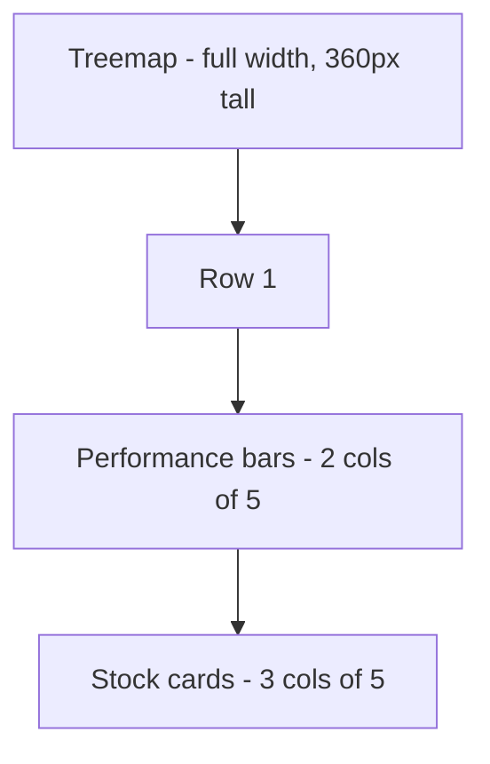

# Sectors — what it is

The Sectors page is the **NIFTY 50 sector overview at `/app/sectors`**. It
shows today's sector performance in three views at once:

1. A **treemap** of sectors — block size by total market cap, block colour
   by today's average % move.
2. A **horizontal bar chart** of the same sector % moves (sorted by
   performance).
3. A **stock list** for the selected sector, paged and filterable.

The page is the place to answer "which sectors are moving today, and
which stocks are in the leading/lagging sectors?"

## What visitors see

A title "Sectors — NIFTY 50" with a subtitle "Today's sector moves at a
glance. Click any block or bar to see its stocks."

Below, three sections in a 2-row layout:

- **Top**: The treemap. Sectors as blocks, sized by total market cap,
  coloured by % move. Click any block to select that sector.
- **Bottom left**: Performance bars. Same sectors, sorted by % move. The
  selected sector is highlighted.
- **Bottom right**: Stock cards for the selected sector. 6 per page with
  a filter and prev/next pager.

The default selection is the first sector in the data (alphabetical, or
whichever the backend sends first). The selection persists across
re-renders until the user clicks a different sector.

## A real example

You open `/app/sectors` on a day when IT is up 2.1%, Banking is up 0.8%,
and Pharma is down 1.2%.

- **Treemap**: IT is the largest block (₹X lakh crore in market cap).
  Banking is smaller. Pharma is mid-sized. IT's block is filled with a
  deep emerald colour. Pharma is filled with a soft red.
- **Performance bars** (sorted descending):
  - IT +2.10% (long green bar to the right)
  - Auto +1.50%
  - FMCG +0.90%
  - Banking +0.80%
  - ...
  - Pharma −1.20% (red bar to the left)
- **Stock cards** (for IT, since it's the default selection):
  - Infosys +2.8%
  - TCS +1.9%
  - Wipro −0.4%
  - HCL Tech +1.6%
  - Tech Mahindra −0.2%
  - LTIMindtree +0.5%
- Click the Pharma block in the treemap. The bar list re-highlights
  Pharma. The stock cards switch to Pharma's constituents (Sun Pharma,
  Dr Reddy's, Cipla, ...).

## Why this page is useful

- **The treemap gives a quick visual hierarchy.** Big sectors jump out.
  Big-and-green = strong sector worth investigating. Big-and-red = weak
  sector to avoid.
- **The performance bars give exact numbers.** The treemap is a
  visual; the bars are quantitative.
- **The stock cards give drill-down.** Click any sector → see its
  members, then click any member → go to the stock terminal.

## What the page does not do

- It does not show historical sector performance. Only today.
- It does not show all NSE sectors. Only the sectors that have Nifty 50
  members.
- It does not show BSE-specific data. NSE-only.
- It does not let you compare sectors across periods. Just today.

## Where it lives in the codebase

- Page: `frontend/app/(app)/app/sectors/page.tsx` (290 lines)
- Treemap: `frontend/app/(app)/app/sectors/components/sector-treemap.tsx` (216 lines)
- Data hook: `useSectorPerformance` from `lib/hooks/use-nse.ts`
- The treemap layout algorithm is the **squarified treemap** (Bruls et al.)
  — implemented in the component itself.

## Backend modules used

- [NSE](../../modules/nse/overview.md) — `GET /sectors` for the sector performance data
  (used to colour the treemap).
- [Market data](../../modules/market-data/overview.md) — per-stock OHLCV for the treemap
  rectangles (size = market cap or volume, colour = day change).
- [Instruments](../../modules/instruments/overview.md) — sector classification metadata.

## Related pages in this folder

- [How it works](how-it-works.md) — the treemap algorithm, the colour
  intensity, the debounce, the pagination, the selection state.
- [Implementation](implementation.md) — file map, the squarified
  treemap math, the colour formula, the `useElementWidth` hook, the
  request traces.