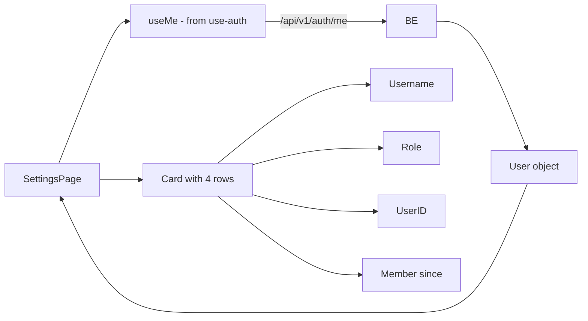

# Settings — how it works

This page walks through the data flow, the layout, the formatter
chain, and the User type.

## The big picture



One API call on mount, four rows of data, no mutations.

## The page itself

```tsx
"use client";

import { Card, CardContent, CardHeader, CardTitle } from "@/components/ui/card";
import { Separator } from "@/components/ui/separator";
import { useMe } from "@/lib/hooks/use-auth";

export default function SettingsPage() {
  const { data: user } = useMe();

  return (
    <div className="mx-auto max-w-2xl space-y-6">
      <h1 className="text-2xl font-semibold">Settings</h1>
      <Card>
        <CardHeader>
          <CardTitle className="text-base">Profile</CardTitle>
        </CardHeader>
        <CardContent className="space-y-3 text-sm">
          <div className="flex items-center justify-between">
            <span className="text-muted-foreground">Username</span>
            <span className="font-mono">{user?.username}</span>
          </div>
          <Separator />
          <div className="flex items-center justify-between">
            <span className="text-muted-foreground">Role</span>
            <span className="font-mono">{user?.role}</span>
          </div>
          <Separator />
          <div className="flex items-center justify-between">
            <span className="text-muted-foreground">User ID</span>
            <span className="max-w-[16rem] truncate font-mono text-xs">{user?.id}</span>
          </div>
          <Separator />
          <div className="flex items-center justify-between">
            <span className="text-muted-foreground">Member since</span>
            <span className="font-mono">
              {user ? new Date(user.created_at).toLocaleDateString() : "—"}
            </span>
          </div>
        </CardContent>
      </Card>
    </div>
  );
}
```

A single client component, 45 lines. The page renders the user's data
from `useMe()`.

## The data flow

`useMe()` is a React Query hook that hits `/api/v1/auth/me`:

```typescript
export const userQueryKey = ["auth", "me"] as const;

export function useMe() {
  return useQuery({
    queryKey: userQueryKey,
    queryFn: me,
    retry: false,
    staleTime: 5 * 60 * 1000,
  });
}
```

The hook is defined in `frontend/lib/hooks/use-auth.ts`. It has:
- `staleTime: 5 * 60 * 1000` (5 minutes) — within 5 minutes, the cache
  is fresh and no network call is made.
- `retry: false` — never retry. If it fails once, the user is treated
  as logged out.

The `user` object has the shape:

```typescript
interface User {
  id: string;
  username: string;
  role: string;
  created_at: string;
}
```

This mirrors the backend's `UserOut` Pydantic model.

## The layout

The page has a simple two-region layout:

1. **Title row**: "Settings" (h1, 24px, semibold).
2. **Card**: a single `Card` with a `CardHeader` (title "Profile") and
   a `CardContent` (the four rows).

The card width is constrained by the parent `max-w-2xl` (672px). On
mobile, the card is full-width up to that limit.

## The four rows

Each row is a flex container with the label on the left and the value
on the right:

```tsx
<div className="flex items-center justify-between">
  <span className="text-muted-foreground">Username</span>
  <span className="font-mono">{user?.username}</span>
</div>
```

The label is muted (`text-muted-foreground`). The value is mono font.
A `<Separator />` divides each row.

### Username

```tsx
<span className="font-mono">{user?.username}</span>
```

The display name. If `user` is undefined (still loading), the row
shows nothing. The username is always defined for a logged-in user.

### Role

```tsx
<span className="font-mono">{user?.role}</span>
```

The user's role. In the current codebase, this is always `"user"` for
self-registered users. The seed users (e.g. `demo`) have role
`"user"` too. The role is not used in any current feature — it is
forward-looking.

### User ID

```tsx
<span className="max-w-[16rem] truncate font-mono text-xs">{user?.id}</span>
```

The UUID-style identifier. The `max-w-[16rem] truncate` limits the
display width and adds an ellipsis for longer IDs. The full ID is
visible by selecting the text and copying.

The `text-xs` (12px) makes the long UUID fit better on a single
line.

### Member since

```tsx
<span className="font-mono">
  {user ? new Date(user.created_at).toLocaleDateString() : "—"}
</span>
```

The account creation date. The `new Date(...).toLocaleDateString()`
formats the date using the browser's locale. For en-IN, this is
"DD/MM/YYYY" or "D/M/YYYY". For en-US, it's "M/D/YYYY".

The `user ? ... : "—"` fallback shows an em-dash when the user is
undefined (loading).

## The theme toggle (not on this page)

The theme toggle is in the topbar, not on the settings page. It is
a small sun/moon button that swaps between light and dark themes.

The toggle is part of the `app-shell.tsx` topbar, present on every
`/app/*` page including `/app/settings`. To change the theme, click
the toggle in the topbar — not in the settings page.

The dark mode is the default. The `Providers` component sets
`defaultTheme="dark"` and `enableSystem={false}`.

## What can go wrong

| Symptom | Cause |
|---|---|
| All four rows show "—" / nothing | `useMe` is loading. Wait a moment. |
| All four rows show "undefined" | The User type is missing a field. Check the backend's `UserOut` schema. |
| User ID is truncated with "…" | The ID is longer than 16rem. Select the text to see the full ID. |
| "Member since" shows "Invalid Date" | The `created_at` string is malformed. Check the backend. |
| 401 on /auth/me | The session cookie is invalid. Log out and back in. |
| Role is empty | The user object is missing the `role` field. The backend should always include it. |

Related: [implementation](implementation.md) for the file map and the
request trace.