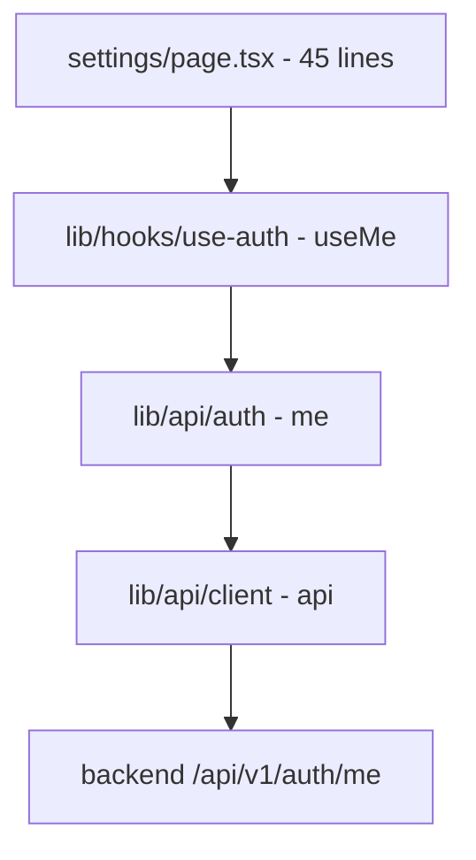
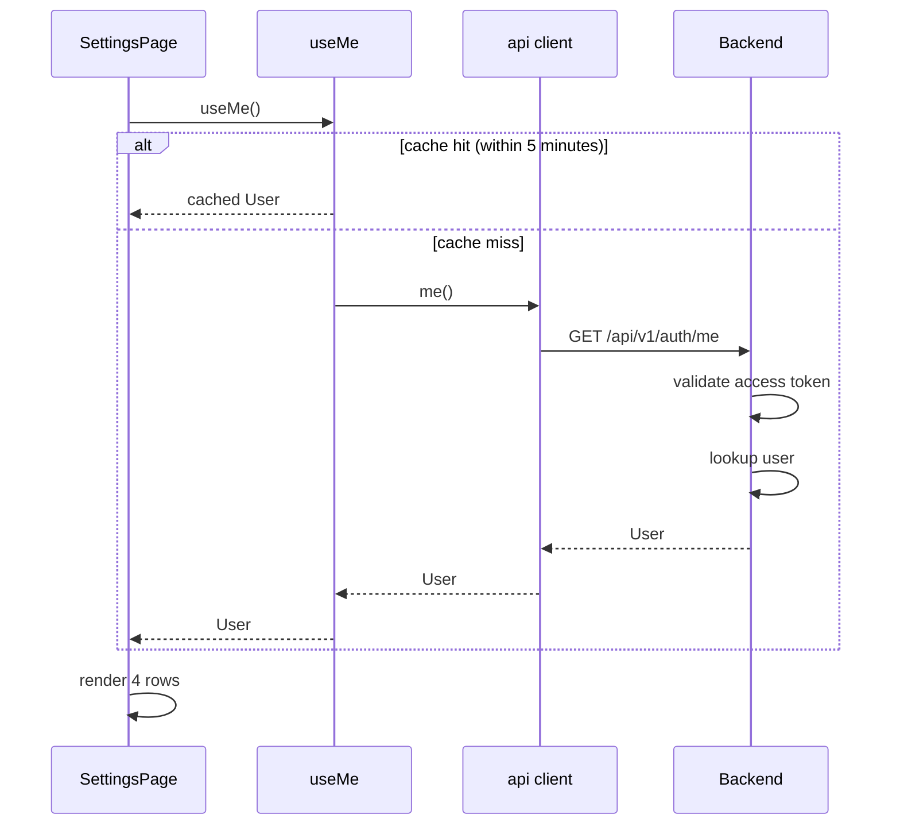

# Settings — implementation (reading the code)

A guide for someone with the repo open. The whole page is one file.

## File map



## 1. `frontend/app/(app)/app/settings/page.tsx` (45 lines)

The whole page. Already covered in detail in `how-it-works.md`. Key
points:

- `"use client"` — required because `useMe` is a client hook.
- 4 lines of imports.
- 1 hook call (`useMe`).
- 1 layout: title + card with 4 rows.
- No state, no mutations, no event handlers.

The page is essentially a static display of the user's profile data.

## 2. The User type

`frontend/lib/api/auth.ts` (30 lines):

```typescript
export interface User {
  id: string;
  username: string;
  role: string;
  created_at: string;
}
```

The `id` is a UUID-style string (e.g. `"8a3f-7b21-c4d9-b21c"`). The
`role` is a free-form string (today always `"user"`). The
`created_at` is an ISO timestamp string (e.g.
`"2026-04-17T10:30:42.123456"`).

The User type mirrors the backend's `UserOut` Pydantic model
field-for-field. If the backend adds a field, the type must be updated
in lockstep.

## 3. The `me` function

```typescript
export async function me(): Promise<User> {
  return api.get<User>("/auth/me");
}
```

One line. Hits `/api/v1/auth/me` and returns the parsed JSON as a
`User` object. The api client handles the `credentials: "include"`
cookie attachment and the JSON parsing.

## 4. The `useMe` hook

```typescript
export const userQueryKey = ["auth", "me"] as const;

export function useMe() {
  return useQuery({
    queryKey: userQueryKey,
    queryFn: me,
    retry: false,
    staleTime: 5 * 60 * 1000,
  });
}
```

The `userQueryKey` is shared across the app. Every component that
calls `useMe` reads from the same React Query cache. The
`userQueryKey` is `as const`, making it a readonly tuple — this lets
TypeScript infer the exact shape and prevents typos.

`staleTime: 5 * 60 * 1000` (5 minutes) — the user is "fresh" for 5
minutes after a successful fetch. Within that window, the cached
value is returned without a network call.

`retry: false` — if `me` fails, the user is treated as logged out
with no retries. This is the right behaviour: a 401 means the session
is dead, and retrying will just get more 401s.

## 5. The `useMe` consumer pattern

The settings page is one of several consumers of `useMe`:

| Consumer | What it does with the user |
|---|---|
| `SettingsPage` | Renders the profile card |
| `AppShell` (`app-shell.tsx`) | Shows the username in the topbar avatar, drives the user menu |
| `AppPage` (`app/page.tsx`) | Greets the user by name |
| `RequireAuth` (auth wrapper) | Renders children only if the user is non-null |
| `LogoutButton` (in `app-shell.tsx`) | Calls `useLogout` which invalidates the user query |

The shared cache means: when one component changes the user (e.g.
login sets the cache, logout clears it), every other component
re-renders with the new value.

## 6. The card layout

```tsx
<Card>
  <CardHeader>
    <CardTitle className="text-base">Profile</CardTitle>
  </CardHeader>
  <CardContent className="space-y-3 text-sm">
    <div className="flex items-center justify-between">
      <span className="text-muted-foreground">Username</span>
      <span className="font-mono">{user?.username}</span>
    </div>
    <Separator />
    ...
  </CardContent>
</Card>
```

The card has three parts:
1. **Header**: a small title "Profile" (16px, semibold).
2. **Content**: 4 rows with `<Separator />` between them.
3. The rows are flex containers with the label on the left and the
   value on the right.

The `space-y-3` on `CardContent` adds vertical spacing between the
rows (and the `<Separator />`s).

The `text-sm` (14px) is the body text size. The values use `font-mono`
for the consistent typewriter look.

## 7. The Separator

```tsx
<Separator />
```

A horizontal rule between the rows. The Separator is from
`@/components/ui/separator` (a Radix UI primitive). It defaults to a
horizontal 1px line in the border colour.

## 8. End-to-end request trace

You open `/app/settings` for the first time:



On a fresh page load, the user query fires. The backend returns the
user in ~50ms. Subsequent navigations to the settings page (within
5 minutes) hit the cache and render instantly.

## 9. Common gotchas

- **The page is read-only.** There is no "Save" button. There are no
  inputs. The user cannot change their profile from this page.
- **The User type is duplicated** between `frontend/lib/api/auth.ts`
  and the backend's `UserOut`. If the backend adds a field, the
  frontend type must be updated in sync.
- **The role is always "user" today.** The backend does not have
  role-based access control. Even if a user has `role: "admin"`, no
  feature on the frontend behaves differently.
- **The user ID is a UUID.** The format is `8a3f-7b21-c4d9-b21c`
  (8-4-4-4-12 hex digits). The frontend truncates it for display
  but the full ID is selectable.
- **The `created_at` is formatted with the browser's locale.** A user
  in the US sees "4/17/2026", a user in India sees "17/4/2026". This
  is intentional — locale-aware date formatting.
- **The settings page does not have a loading state.** When the user
  is `undefined` (loading), the rows show "—" or nothing. The page
  does not render a spinner. This is intentional — the page is
  expected to load instantly from the cache.
- **The theme toggle is not on this page.** The toggle is in the
  topbar. Click the sun/moon icon in the top-right of any `/app/*`
  page.

## 10. Adding a setting

Quick recipe for, say, **a "Last login" field**:

1. **Add the field to the backend response** (in
   `backend/app/modules/auth/router.py` and `schemas.py`).
2. **Add to the TypeScript type**:
   ```typescript
   interface User {
     ...
     last_login: string;
   }
   ```
3. **Add a row to the card**:
   ```tsx
   <Separator />
   <div className="flex items-center justify-between">
     <span className="text-muted-foreground">Last login</span>
     <span className="font-mono">
       {user ? new Date(user.last_login).toLocaleString() : "—"}
     </span>
   </div>
   ```
4. **Format the date** as needed. The example uses `toLocaleString()`
   (date + time) instead of `toLocaleDateString()` (date only).

## Related

- Backend counterpart: [auth module](../../modules/auth/overview.md) — covers
  the `/auth/me` endpoint, the User schema, the JWT mechanics.
- Sibling pages: [auth](../auth/overview.md) (login/register), [dashboard](../dashboard/overview.md) (uses useMe for the greeting).
- Parent page: [overview](overview.md).