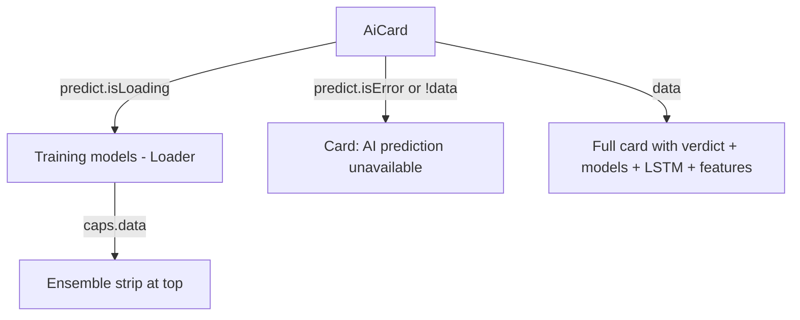

# Stock terminal — how it works

This page walks through the page composition, the data flow per section, the
chart overlay toggles, the verdict math, and the AI card states.

## The big picture

```mermaid
flowchart TD
    URL[/app/stocks/RELIANCE.NS] --> Page[page.tsx - 8 lines]
    Page --> QV[QuoteView client component]
    QV --> BL[BackLink]
    QV --> Header[Header: name, ticker, exchange, price, refresh picker, star]
    QV --> Chart[ChartSection]
    QV --> Today[Today stats card]
    QV --> Range[52-week range card]
    QV --> Verdict[VerdictCard - fusion]
    QV --> News[NewsCard - headlines + mood]
    QV --> AI[AiCard - ML ensemble + LSTM]
    Chart --> PC[PriceChart - candlestick / line]
    Chart --> IHSM[indicators, signal, smc, sr, history]
    Verdict --> FH[useFusion]
    News --> SS[useSentimentScore]
    AI --> MPC[useMlPredict + useLstmForecast + useMlCapabilities]
```

The page is composed of six sections. Each one fetches its own data via a
dedicated hook. The page never touches the api client directly — every
network call goes through a hook that wraps React Query.

## The page entry

`frontend/app/(app)/app/stocks/[symbol]/page.tsx` (8 lines):

```tsx
import { QuoteView } from "./components/quote-view";

export default async function StockPage({ params }: PageProps<"/app/stocks/[symbol]">) {
  const { symbol } = await params;
  return <QuoteView symbol={decodeURIComponent(symbol)} />;
}
```

An **async server component**. It awaits the `params` promise (Next.js
dynamic routes return `params` as a promise), decodes the URL-encoded
symbol, and hands it to `QuoteView`.

The `decodeURIComponent` reverses the encoding that the dashboard's movers
links do (`TATAMOTORS%2ENS` → `TATAMOTORS.NS`).

`QuoteView` is a client component — the rest of the page is client-side.

## Section 1 — Header

The header has the symbol, exchange badge, market status chip, big price,
change %, refresh interval picker, and watchlist star.

### Exchange detection

```typescript
function exchangeOf(symbol: string): string {
  if (symbol.startsWith("^")) return "INDEX";
  if (symbol.endsWith(".BO")) return "BSE";
  return "NSE";
}
```

Three branches:
- `^NSEI`, `^BSESN` → "INDEX".
- `RELIANCE.BO` → "BSE".
- `RELIANCE.NS` and bare symbols → "NSE".

### Live price

The price comes from `useQuote(symbol, intervalSec)`:

```typescript
const quote = useQuote(symbol, intervalSec);
```

The `useQuote` hook (in `lib/hooks/use-market.ts`) returns a React Query
query that auto-refreshes every `intervalSec` seconds via
`refetchInterval`. The header shows a `RefreshCw` spinner while the
refetch is in flight (without re-loading the page).

### Refresh interval picker

```typescript
const REFRESH_INTERVALS = [5, 10, 15, 30, 60] as const;
const DEFAULT_REFRESH_INTERVAL = 10;
```

Five buttons, one per interval. Clicking changes the auto-refetch
interval. The button group shows the current selection with a highlighted
background.

### Watchlist star

`WatchlistStar` is a small button. The `useWatchlistTickers` hook returns
a `Set<string>` of all starred tickers. The star is filled gold when the
current symbol is in the set, outline otherwise. Clicking toggles.

## Section 2 — Chart

`chart-section.tsx` (331 lines). The biggest section. The chart is a
`PriceChart` component from `@/components/charts/price-chart`.

### Data sources (5 in parallel)

```typescript
const history = useHistory(symbol, timeframe.interval, timeframe.period);
const indicators = useIndicators(symbol, timeframe.interval, timeframe.period);
const sr = useSupportResistance(symbol, timeframe.interval, timeframe.period);
const signal = useSignal(symbol, timeframe.interval, timeframe.period);
const smc = useSmc(symbol, timeframe.interval, timeframe.period);
```

All five are React Query hooks fired in parallel on mount. They share the
same query key prefix so the chart re-fetches them all when the timeframe
changes.

### Chart payload

The `PriceChart` component takes a single props object:

```typescript
<PriceChart
  candles={history.data.candles}
  indicators={indicators.data}
  markers={showMarkers ? (signal.data?.markers ?? []) : []}
  srLevels={srLevels}
  smc={smcData}
  showSMC={showSMC}
  chartStyle={style}
  showVolume
  showSma20={showSma20}
  showSma50={showSma50}
  showBB={showBB}
  showRsi={showRsi}
  showMacd={showMacd}
/>
```

- `candles` — the OHLCV array from `/api/v1/market-data/history`.
- `indicators` — `{ sma_20, sma_50, bb_upper, bb_lower, rsi, macd, ... }`.
- `markers` — buy/sell markers from `/api/v1/signals/signal`.
- `srLevels` — support/resistance lines from `/api/v1/analytics/sr`.
- `smc` — order blocks, FVGs, premium/discount zones from
  `/api/v1/smc/compute`.
- `chartStyle` — `"candles"` or `"line"`.
- The booleans toggle which overlays render.

### Chart toggles

The header has 4 button groups:

| Group | Toggles |
|---|---|
| **Timeframe** | 1D, 1W, 1M (mutually exclusive) |
| **Chart style** | Candles, Line (mutually exclusive) |
| **Overlays** | SMA 20, SMA 50, BB (independent) |
| **Panels** | RSI, MACD, S/R, Signals (independent) |
| **SMC** | SMC master + OB, FVG, Zones (sub-toggles only when SMC is on) |

The toggles are local `useState` in `ChartSection`. The S/R and SMC data are
filtered based on the toggles — if `showSR` is off, the levels are
filtered out before being passed to the chart.

The defaults match the Streamlit version:
- `showSma20: true`, `showSma50: true`, `showBB: false`
- `showRsi: true`, `showMacd: false`, `showSR: true`, `showMarkers: true`
- `showSMC: false` (SMC is opt-in because it adds visual clutter)
- When `showSMC` is true, the sub-toggles `showOB`, `showFVG`, `showZones`
  are shown and default to `true`.

### Error states

- `history.isLoading` → 420px skeleton.
- `history.isError`:
  - 404 (symbol not found) → "No chart data available for {symbol}."
  - Other → "Could not load chart data right now." with a Retry button.
- Empty data → "No data in range."

The chart does not render if `history` fails. The other panels (verdict,
news, AI) still render — they each have their own data sources.

## Section 3 — Today stats

A card with 6 stats in a 3-column grid:

| Stat | Source | Field |
|---|---|---|
| Open | `info.data.info.open` or `quote.data.price` | `open` |
| Prev close | `quote.data.previous_close` or `info.data.info.previousClose` | `previousClose` |
| Day high | `info.data.info.dayHigh` | `dayHigh` |
| Day low | `info.data.info.dayLow` | `dayLow` |
| Volume | `info.data.info.volume` | `volume` |
| Avg volume (10D) | `info.data.info.averageVolume10Day` | `averageVolume10Day` |

The `infoNumber(meta, key)` helper:

```typescript
function infoNumber(info: Record<string, unknown>, key: string): number | null {
  const v = info[key];
  return typeof v === "number" && Number.isFinite(v) ? v : null;
}
```

Returns `null` for non-numeric or missing values. The format helpers handle
`null` gracefully — they show "—".

`formatCompact` formats large numbers as "1.2M", "8.5B", etc.

## Section 4 — 52-week range

A card with the 52-week low/high and a position bar:

```typescript
<RangeBar low={low} high={high} current={quote.data?.price ?? null} />
```

`RangeBar` computes the current position as a percentage of the
low-to-high range and renders a marker on a gradient bar. The gradient
goes from `down` (red) on the left to `gold` (yellow) in the middle to
`up` (green) on the right.

If any of `low`, `high`, `current` is null, or `high <= low`, it shows a
skeleton instead.

Below the bar: market cap from `info.data.info.marketCap`.

## Section 5 — Fusion verdict

`verdict-card.tsx` (265 lines). A 320-wide card with the 3-layer blend.

### Data

```typescript
const fusion = useFusion(symbol, timeframe.interval, timeframe.period);
```

The `useFusion` hook hits `/api/v1/signals/fusion` and returns the full
fusion response.

### Verdict badge

```typescript
<VerdictBadge verdict={fusion.data.final_label} size="lg" />
<span className="font-mono text-lg font-bold">
  {fusion.data.fused_score > 0 ? "+" : ""}{fusion.data.fused_score.toFixed(2)}
</span>
```

`VerdictBadge` is from `@/components/signals/verdict-badge`. The big text
shows the signed fused score (-1.0 to +1.0).

### 3-layer blend

Three `BlendBar` components, one per layer:

```typescript
<BlendBar label="Technical" score={fusion.data.layers.technical.score} weight={fusion.data.layers.technical.weight} ... />
<BlendBar label="ML ensemble" score={fusion.data.layers.ml.score} weight={fusion.data.layers.ml.weight} available={...} ... />
<BlendBar label="News NLP" score={fusion.data.layers.news.score} weight={fusion.data.layers.news.weight} available={...} ... />
```

Each bar:
- Maps the score (-1 to +1) to a percentage of the bar (-50% to +50% from
  the centre).
- The bar fills with `up` (green) for positive, `down` (red) for negative,
  `gold` (yellow) for near-zero.
- A centre notch (1px line) marks the zero point.

If a layer is missing (e.g. no ML model trained yet), the bar is dimmed to
40% opacity and the tooltip explains the absence.

### Confidence badge

A small pill that says "HIGH" / "MEDIUM" / "LOW" based on
`fusion.data.confidence_tier`. The colour matches the tier (green / gold /
muted).

### Active rules and reasons

Below the bars, the card shows the top 6 active rules and the top
reasons. Each is a small bullet. The list is sourced from
`fusion.data.layers.technical.signals` and `.reasons`.

## Section 6 — News & mood

`news-card.tsx` (224 lines). A 2-column layout.

### Data

```typescript
const { data, isLoading, isError } = useSentimentScore(symbol, timeframe.interval as Interval, timeframe.period as Period);
```

The `useSentimentScore` hook hits `/api/v1/sentiment/score` and returns:
- `data.news.score` — the news mood (-1 to +1).
- `data.news.label` — "BULLISH" / "BEARISH" / "NEUTRAL" / "POSITIVE" / "NEGATIVE".
- `data.news.detail` — the headlines with per-headline scores.
- `data.technical.score` / `.label` — the chart mood.
- `data.technical.signals` — the top active rules (filtered to non-NEUTRAL).

### Left column: two mood cards

1. **News mood**: the headline tone (BULLISH/BEARISH/NEUTRAL) with the
   score and a meter.
2. **Chart mood**: the technical tone (BULLISH/BEARISH/NEUTRAL) with the
   score, a meter, and the top 3 active rules.

The meter is a horizontal bar with a gradient (down → muted → up) and a
position marker. The score maps to 0–100% along the bar.

### Right column: headlines

A list of headlines. Each headline has:
- A coloured badge with the score's sign and magnitude (e.g. "+42" or
  "−18").
- The headline text.

The headlines come from RSS feeds (MoneyControl, Economic Times,
Business Standard). Each is scored by FinBERT if available, otherwise by
keyword analysis.

## Section 7 — AI prediction

`ai-card.tsx` (279 lines). The most complex card on the page.

### Data sources (3 in parallel)

```typescript
const caps = useMlCapabilities();
const predict = useMlPredict(symbol);
const lstm = useLstmForecast(symbol, timeframe.interval, timeframe.period);
```

`useMlCapabilities` is a one-shot fetch (no symbol). It returns the
available models, the active ensemble, and which optional dependencies
(XGBoost, LightGBM, CatBoost, PyTorch) are installed.

`useMlPredict` hits `/api/v1/ml/predict?symbol={sym}`. The first call
**trains** the models on the symbol's history (can take up to a minute).
Subsequent calls are cached.

`useLstmForecast` hits `/api/v1/ml/lstm-forecast?symbol={sym}&...`. The
LSTM is optional — if PyTorch is not installed, the response has
`available: false` and the card hides the LSTM panel.

### States

The component has four render branches:



The loading state shows "Training XGBoost · LightGBM · CatBoost on
RELIANCE…" with a dots loader. The `caps.data` drives the model names in
the strip.

The full render has:

1. **Ensemble strip** — coloured pills for each active model
   (XGBoost, LightGBM, CatBoost, etc.).
2. **Verdict panel** (left) — the big "UP/DOWN" pill, confidence tier,
   next-candle price, probability gauge, 1d/3d/5d horizons, walk-forward
   accuracy, train/test sizes.
3. **Right rail** — three cards: Model accuracy (holdout %), LSTM
   tomorrow's price (if available), Top features (SHAP importance).
4. **Footer** — a tiny disclaimer: "Model estimates, not investment
   advice — trained on historical prices only."

### Probability gauge

`ProbGauge` renders the up probability as a filled bar over a `down/30`
background. The bar is `bg-up` (green) and grows from the left to
`upProb%`. A 1px centre notch at 50% marks the threshold. The labels
under the bar show "(100 − upProb)% down" and "upProb% up".

### Model accuracy cards

Each model is a coloured pill. The colour is based on the holdout
accuracy:
- ≥ 55% → green (`border-up/30 bg-up/10 text-up`).
- ≥ 50% → muted (`border-border bg-muted text-muted-foreground`).
- < 50% → red (`border-down/30 bg-down/10 text-down`).

The threshold is hardcoded. 50% is "coin-flip level" — anything below that
is worse than random.

### LSTM forecast

If `lstm.data.available` is true, the card shows:
- A predicted close in ₹ (large font).
- A signed % change vs today's close (small font, coloured by sign).

The LSTM is the 60-day lookback model from the backend. It learns price
patterns only. The InfoTip says "A neural network that reads the last 60
daily closes and predicts the next day's closing price in ₹. It learns
price patterns only — treat it as one opinion, not a promise."

### Top features

The SHAP-derived top features. Each feature is a small bar where the
width is `min(100, importance × 400)`. The 400 multiplier is to make the
importance values visible (SHAP values are typically small).

## What can go wrong

| Symptom | Cause |
|---|---|
| "We couldn't find RELIANCE.NS" | The backend does not recognise the symbol. Check the ticker. |
| Chart shows skeleton forever | `useHistory` is failing. Check the network tab. |
| All overlays off by default | You clicked the toggles. They reset on refresh, not on navigation. |
| Verdict card is empty | `useFusion` failed. The backend's signal engine might be down. |
| "Verdict unavailable right now" | The fusion endpoint returned an error. Try again. |
| AI card stuck on "Training models" | The first predict call for this symbol. Wait up to a minute. |
| "AI prediction unavailable" | The ML pipeline failed. Check `/api/v1/ml/capabilities` to see which models are installed. |
| LSTM card missing | PyTorch is not installed. The backend returns `available: false` and the card hides itself. |
| News & mood empty | No recent headlines. Common for less-covered tickers. |
| News & mood "unavailable" | The RSS feeds are down. Common on weekends. |
| Watchlist star does nothing | The `useWatchlistTickers` hook is loading. Wait a moment and try again. |
| The 52-week range shows a skeleton | `useStockInfo` is loading. The skeleton disappears when the data arrives. |
| Page flickers between two price values | The 10s auto-refresh. The first paint uses the cached value, the second the fresh value. |

Related: [implementation](implementation.md) for the file map and the
request traces.