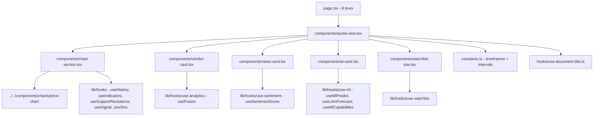
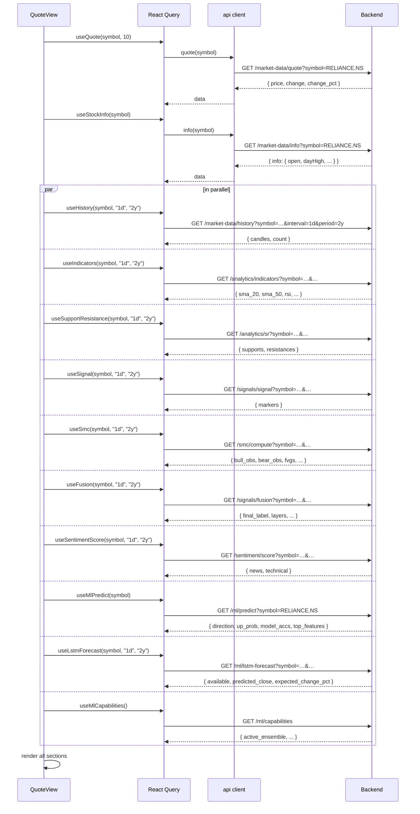
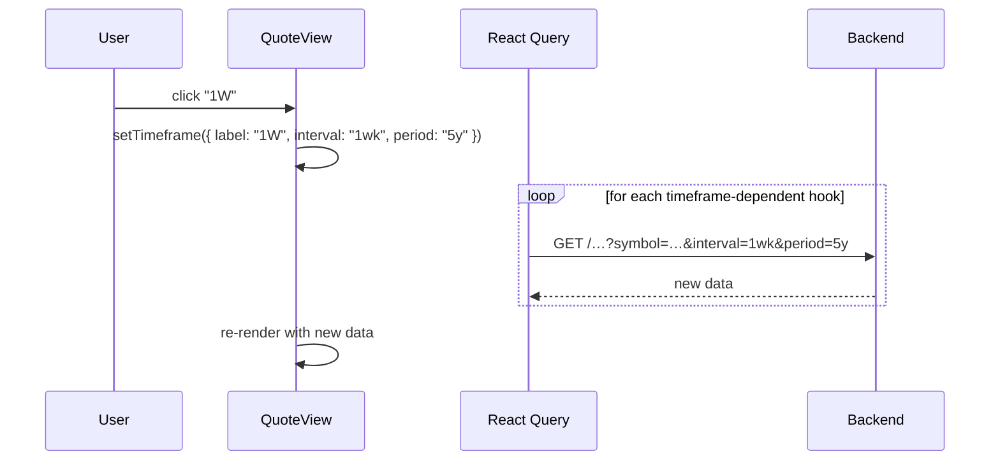

# Stock terminal — implementation (reading the code)

A guide for someone with the repo open. Read the files in this order.

## File map



## 1. `frontend/app/(app)/app/stocks/[symbol]/page.tsx` (8 lines)

```tsx
import { QuoteView } from "./components/quote-view";

export default async function StockPage({ params }: PageProps<"/app/stocks/[symbol]">) {
  const { symbol } = await params;
  return <QuoteView symbol={decodeURIComponent(symbol)} />;
}
```

An async server component. Awaits `params` (Next.js dynamic route contract),
URL-decodes the symbol, passes to the client `QuoteView`.

## 2. `frontend/app/(app)/app/stocks/[symbol]/constants.ts` (24 lines)

```typescript
export const REFRESH_INTERVALS = [5, 10, 15, 30, 60] as const;
export type RefreshInterval = (typeof REFRESH_INTERVALS)[number];
export const DEFAULT_REFRESH_INTERVAL: RefreshInterval = 10;

export interface Timeframe {
  label: "1D" | "1W" | "1M";
  interval: Interval;
  period: Period;
}

export const TIMEFRAMES: Timeframe[] = [
  { label: "1D", interval: "1d", period: "2y" },
  { label: "1W", interval: "1wk", period: "5y" },
  { label: "1M", interval: "1mo", period: "10y" },
];

export const DEFAULT_TIMEFRAME = TIMEFRAMES[0];
```

Three timeframes. The `interval` and `period` are passed to yfinance via
the backend. The 1D/1W/1M labels are user-facing.

The constants match the Streamlit app's `TF_MAP` (app.py:980-984) and
`select_slider` (app.py:1022).

## 3. `frontend/app/(app)/app/stocks/[symbol]/hooks/use-document-title.ts`

A tiny hook that sets `document.title` based on the symbol. When you
navigate to `/app/stocks/RELIANCE.NS`, the browser tab title becomes
"RELIANCE.NS · StockView India".

```typescript
export function useDocumentTitle(symbol: string) {
  useEffect(() => {
    document.title = `${decodeURIComponent(symbol)} · StockView India`;
    return () => { document.title = "StockView India"; };
  }, [symbol]);
}
```

The cleanup resets the title on unmount.

## 4. `components/quote-view.tsx` (335 lines)

The page composition. Already covered in detail in `how-it-works.md`. Key
parts:

- The header (name, ticker, exchange, price, refresh picker, star).
- The 404 state (when the symbol is not found).
- The 4-section grid: Today stats | 52-week range + Verdict.
- NewsCard and AiCard below.
- Helper components: `exchangeOf`, `infoNumber`, `infoString`, `Stat`,
  `RangeBar`, `BackLink`.

### Key code: 404 detection

```typescript
const notFound = quote.error instanceof ApiError && quote.error.status === 404;

if (notFound) {
  return (
    <div className="mx-auto flex max-w-6xl flex-col gap-4">
      <BackLink />
      <Card className="border-dashed">
        <CardContent className="...">
          <p>We couldn't find "{symbol}"</p>
          <p>Check the ticker and try the search bar again.</p>
          <Button asChild variant="outline" size="sm" className="mt-2">
            <Link href="/app">Back to dashboard</Link>
          </Button>
        </CardContent>
      </Card>
    </div>
  );
}
```

The 404 check uses `instanceof ApiError` because the api client throws
`ApiError` for non-2xx responses. A 404 from `/api/v1/market-data/quote`
becomes an `ApiError` with `status: 404`. The page renders the empty state
instead of the chart.

### Key code: data fallback for Open

```typescript
<Stat
  label="Open"
  value={
    infoNumber(meta, "open") !== null
      ? formatINR(infoNumber(meta, "open"))
      : quote.data
        ? formatINR(quote.data.price)
        : "—"
  }
/>
```

The `info` endpoint is optional and often missing fields. If `open` is
null, fall back to the current price (a rough proxy), or "—" if no quote.

### Key code: RangeBar

```typescript
function RangeBar({ low, high, current }: { low: number | null; high: number | null; current: number | null }) {
  if (low === null || high === null || current === null || high <= low) {
    return <Skeleton className="h-1.5 w-full rounded-full" />;
  }
  const pos = Math.min(100, Math.max(0, ((current - low) / (high - low)) * 100));
  return (
    <div className="relative h-1.5 w-full rounded-full bg-gradient-to-r from-down/60 via-gold/60 to-up/60">
      <span
        className="absolute top-1/2 size-3 -translate-x-1/2 -translate-y-1/2 rounded-full border-2 border-background bg-foreground shadow"
        style={{ left: `${pos}%` }}
        title={formatINR(current)}
      />
    </div>
  );
}
```

The marker position is `((current - low) / (high - low)) × 100`, clamped
to [0, 100]. The gradient is the Tailwind `bg-gradient-to-r from-down/60
via-gold/60 to-up/60` — a 3-stop gradient from red to yellow to green.

The `high <= low` guard catches the edge case where yfinance returns
nonsense.

## 5. `components/chart-section.tsx` (331 lines)

Already covered in `how-it-works.md`. The file has three top-level pieces:

| Piece | Purpose |
|---|---|
| `Toggle` | A reusable toggle button with active state styling |
| `ChartSection` | The chart with header (toggles) and the `PriceChart` body |
| `RangeBar` style legend | A small footer with the colour key for the active overlays |

### State

The component holds 12 local `useState` calls — one per toggle. The
defaults match the Streamlit app.

### Data flow

```typescript
const history = useHistory(symbol, timeframe.interval, timeframe.period);
const indicators = useIndicators(symbol, timeframe.interval, timeframe.period);
const sr = useSupportResistance(symbol, timeframe.interval, timeframe.period);
const signal = useSignal(symbol, timeframe.interval, timeframe.period);
const smc = useSmc(symbol, timeframe.interval, timeframe.period);
```

All five hooks are React Query queries. They share the symbol and
timeframe so the queries are re-used across section navigation.

### Derived data

```typescript
const srLevels: SRLevel[] = showSR
  ? [
      ...(sr.data?.supports ?? []).map((price) => ({ price, kind: "support" as const })),
      ...(sr.data?.resistances ?? []).map((price) => ({ price, kind: "resistance" as const })),
    ]
  : [];

const smcData = useMemo(() => {
  if (!showSMC || !smc.data) return null;
  return {
    ...smc.data,
    bull_obs: showOB ? smc.data.bull_obs : [],
    bear_obs: showOB ? smc.data.bear_obs : [],
    fvgs: showFVG ? smc.data.fvgs : [],
    range_high: showZones ? smc.data.range_high : null,
    range_low: showZones ? smc.data.range_low : null,
    equilibrium: showZones ? smc.data.equilibrium : null,
  };
}, [showSMC, showOB, showFVG, showZones, smc.data]);
```

The S/R data is a flat array of `{price, kind}` derived from the supports
and resistances arrays. The SMC data is memoized because the toggle
combinations can change every render — memoization keeps the chart from
re-rendering on unrelated state changes.

### Chart legend

Below the chart, a small footer explains the colours:

```typescript
<div className="mt-2 flex flex-wrap items-center gap-x-4 gap-y-1 font-mono text-[11px] text-muted-foreground">
  <span className="flex items-center gap-1.5">
    <span className="h-0.5 w-4 bg-gold" /> SMA 20
  </span>
  ...
  <span>{history.data.count} bars</span>
</div>
```

The bar count is shown so the user can see how many candles the chart
contains.

## 6. `components/verdict-card.tsx` (265 lines)

The 3-layer fusion card. Already covered in detail in `how-it-works.md`.
Key parts:

### BlendBar

```typescript
function BlendBar({ label, icon, score, weight, available, tooltip }) {
  const pct = Math.round(((score + 1) / 2) * 100);  // 0 to 100
  const barLeft = Math.min(pct, 50);
  const barWidth = Math.abs(pct - 50);
  const color = score > 0.05 ? "bg-up" : score < -0.05 ? "bg-down" : "bg-gold";
  ...
  return (
    <div className={cn("space-y-1", !available && "opacity-40")}>
      <div className="flex items-center justify-between">
        <span>{icon}{label}<span>{Math.round(weight * 100)}%</span><InfoTip>{tooltip}</InfoTip></span>
        <span className="font-mono text-xs">{sign}{score.toFixed(2)}</span>
      </div>
      <div className="relative h-1.5 w-full overflow-hidden rounded-full bg-muted">
        <span aria-hidden className="absolute left-1/2 top-0 h-full w-px bg-border" />
        <span className={cn("absolute top-0 h-full rounded-full", color)} style={{ left: `${barLeft}%`, width: `${barWidth}%` }} />
      </div>
    </div>
  );
}
```

The bar maps the score (-1 to +1) to a percentage of the bar (-50% to
+50% from the centre). The `barLeft` and `barWidth` are computed so the
filled portion always starts at the centre and extends left or right.

The colour thresholds are hardcoded:
- `> 0.05` → green (up)
- `< -0.05` → red (down)
- between → gold (neutral)

The `opacity-40` class on the wrapper dims the bar when the layer is
unavailable.

### Confidence badge

```typescript
function ConfidenceBadge({ tier, tone }) {
  const color = tier === "HIGH" ? "bg-up/10 text-up border-up/20" : tier === "MEDIUM" ? "bg-gold/10 text-gold border-gold/20" : "bg-muted text-muted-foreground border-border";
  return (
    <span className="..." title={tone}>
      <Shield className="size-3" />
      {tier}
    </span>
  );
}
```

The badge shows the tier (HIGH/MEDIUM/LOW) with a coloured background.
The `tone` is the longer explanation from the backend (e.g. "Walk-forward
accuracy above 56%") — it shows as a tooltip on hover.

## 7. `components/news-card.tsx` (224 lines)

The news + mood card. Already covered. Key helpers:

### toneOf

```typescript
function toneOf(label: string): Tone {
  const l = label.toUpperCase();
  if (l === "BULLISH" || l === "POSITIVE") return "up";
  if (l === "BEARISH" || l === "NEGATIVE") return "down";
  return "flat";
}
```

Two encodings are accepted: BULLISH/BEARISH (the technical mood labels)
and POSITIVE/NEGATIVE (the news labels). NEUTRAL falls through to "flat".

### MoodMeter

```typescript
function MoodMeter({ score, tone }) {
  const pos = ((Math.max(-1, Math.min(1, score)) + 1) / 2) * 100;
  return (
    <div className="relative h-2 w-full rounded-full bg-gradient-to-r from-down/50 via-muted to-up/50">
      <span aria-hidden className="absolute top-0 left-1/2 h-full w-px bg-border" />
      <span className={cn("absolute top-1/2 size-3.5 -translate-x-1/2 -translate-y-1/2 rounded-full border-2 border-background shadow", ...)} style={{ left: `${pos}%` }} />
    </div>
  );
}
```

The score (-1 to +1) maps to 0–100% along the gradient. The marker is
coloured by tone (green / red / muted).

## 8. `components/ai-card.tsx` (279 lines)

The ML prediction card. Already covered. Key code:

### Capability strip

```typescript
{caps.data ? (
  <div className="flex flex-wrap items-center gap-1.5">
    <span className="text-xs text-muted-foreground">Ensemble:</span>
    {caps.data.active_ensemble.map((m) => (
      <span key={m} className="rounded-full border border-ai/30 bg-ai/10 px-2 py-0.5 font-mono text-[11px] font-semibold text-ai">
        {m}
      </span>
    ))}
  </div>
) : null}
```

The strip shows the active models as coloured pills. The colour is the
"ai" theme colour (a custom blue in `globals.css`).

### ProbGauge

```typescript
function ProbGauge({ upProb }: { upProb: number }) {
  const up = upProb >= 50;
  return (
    <div className="space-y-1.5">
      <div className="relative h-2.5 w-full overflow-hidden rounded-full bg-down/30">
        <div className="h-full rounded-full bg-up transition-all duration-500" style={{ width: `${upProb}%` }} />
        <span aria-hidden className="absolute top-0 left-1/2 h-full w-px bg-border" />
      </div>
      <div className="flex justify-between font-mono text-[11px] text-muted-foreground">
        <span className="text-down">{(100 - upProb).toFixed(1)}% down</span>
        <span className={cn("font-semibold", up ? "text-up" : "text-up")}>{upProb.toFixed(1)}% up</span>
      </div>
    </div>
  );
}
```

The bar is a `bg-down/30` track (red 30% opacity) with a `bg-up` filled
portion that grows from 0% to `upProb%`. The CSS transition (`duration-500`)
makes the bar animate when the value changes.

The labels under the bar show "(100 − upProb)% down" and "upProb% up". Both
labels are coloured green — this is intentional. The "down" label is red
on hover (the `text-down` class), but the layout keeps both visible.

### Horizons

```typescript
<div className="grid grid-cols-3 gap-2">
  {Object.entries(r.horizon).map(([h, p]) => (
    <div key={h} className="flex items-center justify-between rounded-lg bg-muted/60 px-3 py-2">
      <span className="text-xs text-muted-foreground">{h}d</span>
      <span className={cn("font-mono text-sm font-semibold", p.direction === "up" ? "text-up" : "text-down")}>
        {p.prob.toFixed(1)}%
      </span>
    </div>
  ))}
</div>
```

Three small cards: 1d, 3d, 5d. Each shows the up-probability for that
horizon. The colour is green if direction is "up", red if "down".

### Top features (SHAP)

```typescript
{r.top_features.length > 0 ? (
  <Card>
    ...
    <CardContent>
      {r.top_features.map((f) => (
        <div key={f.feature} className="flex items-center gap-2">
          <span className="w-24 shrink-0 font-mono text-[11px] text-muted-foreground">{f.feature}</span>
          <div className="h-1.5 flex-1 overflow-hidden rounded-full bg-muted">
            <div className="h-full rounded-full bg-ai/70" style={{ width: `${Math.min(100, f.importance * 400)}%` }} />
          </div>
        </div>
      ))}
    </CardContent>
  </Card>
) : null}
```

The feature name is fixed-width (24 chars). The bar width is
`min(100, importance × 400)`. The 400 multiplier is to make SHAP values
visible — raw SHAP importances are typically 0.01–0.05.

## 9. `components/watchlist-star.tsx` (40 lines)

The star button. Already covered. Key code:

```typescript
const tickers = useWatchlistTickers();
const add = useAddToWatchlist();
const remove = useRemoveFromWatchlist();

const starred = tickers.has(ticker);
const busy = add.isPending || remove.isPending;

return (
  <Button ... disabled={busy} aria-pressed={starred} onClick={() => (starred ? remove.mutateAsync(ticker) : add.mutateAsync(ticker))}>
    <Star className={cn("size-4", starred ? "fill-gold text-gold" : "text-muted-foreground")} />
  </Button>
);
```

`useWatchlistTickers` returns a `Set<string>` for O(1) membership check.
The button shows a gold-filled star when starred, outline otherwise. The
button is disabled while a mutation is pending.

## 10. The hooks used

| Hook | Endpoint | Refresh |
|---|---|---|
| `useQuote` | `GET /market-data/quote?symbol=…` | Polls every N seconds (configurable) |
| `useStockInfo` | `GET /market-data/info?symbol=…` | Once, cache |
| `useHistory` | `GET /market-data/history?symbol=…&interval=…&period=…` | Refetch on timeframe change |
| `useIndicators` | `GET /analytics/indicators?symbol=…&…` | Refetch on timeframe change |
| `useSupportResistance` | `GET /analytics/sr?symbol=…&…` | Refetch on timeframe change |
| `useSignal` | `GET /signals/signal?symbol=…&…` | Refetch on timeframe change |
| `useSmc` | `GET /smc/compute?symbol=…&…` | Refetch on timeframe change |
| `useFusion` | `GET /signals/fusion?symbol=…&…` | Refetch on timeframe change |
| `useSentimentScore` | `GET /sentiment/score?symbol=…&…` | Refetch on timeframe change |
| `useMlCapabilities` | `GET /ml/capabilities` | Once, cache |
| `useMlPredict` | `GET /ml/predict?symbol=…` | Once per symbol (first call trains) |
| `useLstmForecast` | `GET /ml/lstm-forecast?symbol=…&…` | Once per symbol+timeframe |
| `useWatchlistTickers` | `GET /portfolio/watchlist` (cache) | Refetch on watchlist mutation |
| `useAddToWatchlist` | `POST /portfolio/watchlist` | Mutation |
| `useRemoveFromWatchlist` | `DELETE /portfolio/watchlist/{ticker}` | Mutation |

The chart and verdict-related hooks all share the same `timeframe` as a
query key fragment, so changing the timeframe re-fetches all of them
together. The price quote is the only thing that auto-polls.

## 11. End-to-end request trace — page load

You click RELIANCE.NS on the dashboard. The stock terminal mounts:



Eleven endpoints fire in parallel on first load. With the backend's
Redis cache, most resolve in <100ms. The ML predict can take up to a
minute the first time for a symbol.

## 12. End-to-end request trace — change to 1W

You click "1W" in the timeframe picker. The `onTimeframeChange` callback
updates the `timeframe` state in `QuoteView`. React Query sees the new
query key fragment and refetches all hooks that depend on it:



The hooks that refetch:
- `useHistory` → 5 years of weekly bars.
- `useIndicators` → recomputed on weekly bars.
- `useSupportResistance` → recomputed.
- `useSignal` → recomputed.
- `useSmc` → recomputed.
- `useFusion` → recomputed.
- `useSentimentScore` → recomputed.
- `useLstmForecast` → refetched with the new interval/period.

The hooks that **don't** refetch:
- `useQuote` (timeframe-independent).
- `useStockInfo` (timeframe-independent).
- `useMlPredict` (timeframe-independent).
- `useMlCapabilities` (no symbol).

## 13. Common gotchas

- **First ML predict call is slow.** The backend trains the models. Show a
  loader (the `AiCard` already does this). The next call uses the cache.
- **SMC data is opt-in.** The user has to click the "SMC" button to see
  the zones. Default is off because SMC adds visual clutter.
- **Timeframe changes are not persisted.** Refresh the page and you go
  back to 1D. To persist, add a URL param or sessionStorage.
- **The 1M timeframe uses 10 years of monthly data.** This can be slow
  for first-time fetches. The yfinance call is heavy.
- **Some symbols do not have info data.** Small-caps, recently-listed
  stocks, and indices have sparser yfinance info. The page falls back to
  showing "—" rather than crashing.
- **The verdict card is 320px wide on desktop.** On smaller screens, it
  stacks above the chart. The 3-bar blend remains readable.
- **The watchlist star does not show feedback.** It does not show a toast
  on add/remove. To add one, wrap the click in `toast.promise`.
- **The chart legend is hidden when SMC is off.** The OB / FVG / EQ rows
  are conditional on `showSMC && smcData`.
- **Volume bar is always on.** The `showVolume` prop is hardcoded `true`
  on the chart. To add a toggle, add a new `useState`.
- **The 1D timeframe period is "2y".** This is intentional — yfinance
  supports `1y` and `2y` but not custom ranges. 2 years of daily bars
  gives ~500 candles, enough for the indicators to compute meaningfully.
- **Back navigation works.** Browser back from `/app/stocks/RELIANCE.NS`
  goes to the dashboard or wherever you came from. The router state
  preserves the referrer.

## Related

- Backend counterparts for every endpoint:
  - [market-data](../../modules/market-data/overview.md) — quote, info, history.
  - [analytics](../../modules/analytics/overview.md) — indicators, sr.
  - [signals](../../modules/signals/overview.md) — signal, fusion.
  - [smc](../../modules/smc/overview.md) — smc.
  - [sentiment](../../modules/sentiment/overview.md) — sentiment score.
  - [ml](../../modules/ml/overview.md) — predict, lstm, capabilities.
- Sibling page: [dashboard](../dashboard/overview.md) — where the user
  comes from.
- Charts: `frontend/components/charts/price-chart.tsx`.
- Parent page: [overview](overview.md).