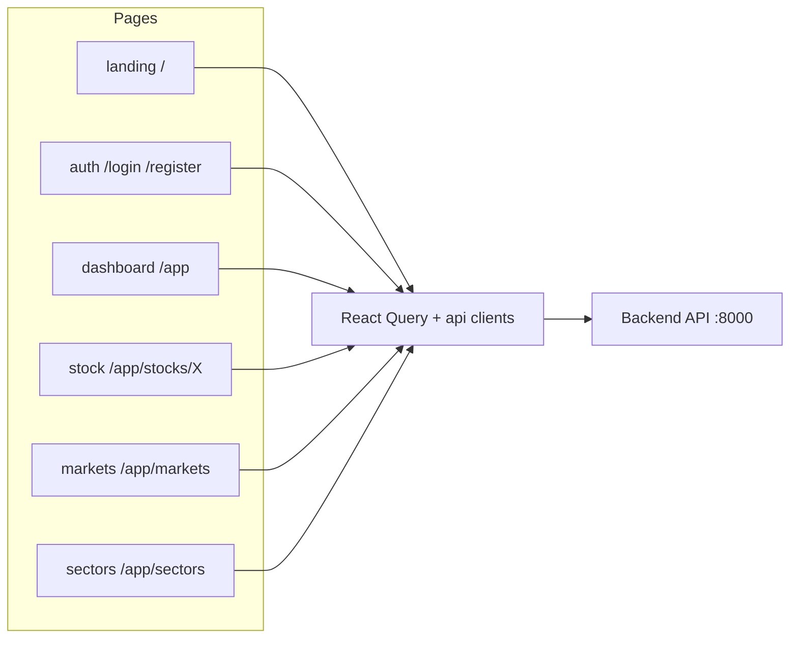

# StockView Frontend — Docs

Plain-language docs, one folder per page/feature. Each file is small.

## How the frontend works

A Next.js website (the "face") that asks the backend (the "brain") for data
and draws the screens. Run with `npm run dev` from `frontend/` →
http://localhost:3000. All fetching goes through **React Query** (caches,
retries, keeps pages snappy). Structure rule: a page's components live
beside its `page.tsx`; shared pieces in global `components/` and `lib/`.

## Page index

| Folder | Page | One line |
|---|---|---|
| [landing/](landing/overview.md) | `/` | Public marketing homepage |
| [auth-pages/](auth-pages/overview.md) | `/login`, `/register` | Sign in / register |
| [dashboard/](dashboard/overview.md) | `/app` | Your home screen |
| [stock-terminal/](stock-terminal/overview.md) | `/app/stocks/[symbol]` | Chart + verdict page |
| [markets/](markets/overview.md) | `/app/markets` | NSE quotes, flows, options |
| [sectors/](sectors/overview.md) | `/app/sectors` | Sector treemap |

Look & feel: [design-system/](design-system/colors.md). Coming later: news,
AI, paper trading, alerts, backtesting, ledger (`plan/06-rebuild-plan.md`).
