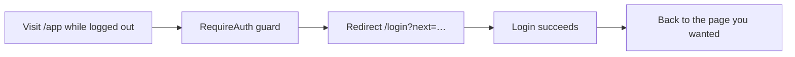

# Auth Pages — Overview

**Plain words:** the doors into your account. Register creates a username +
password; login signs you back in.

## What you'll see

- Clean centered card, app logo, username/password fields with friendly
  validation messages ("password too short").
- A demo-account hint (`demo / demo123`) on the login page.
- After login you land on the dashboard (`/app`).

## How it feels (technical bits, simply)

- Passwords never appear in logs; forms talk to `/auth` endpoints and receive
  secure httpOnly cookies.
- If your session expires mid-click, the app silently renews it once; only
  if that fails are you sent back to login — no error loops.
- Visiting `/app…` while logged out bounces you here first, then returns you
  to the page you wanted.

## Where the code lives

`frontend/app/(auth)/login/` and `register/`; guard:
`components/auth/require-auth.tsx`; hook: `lib/hooks/use-auth.ts`.
