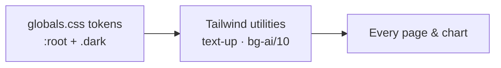

# Design System — Colors

The rulebook of how the app looks. Learn the color language once and you can
read every screen.

## Color language

| Color | Meaning |
|---|---|
| **Emerald** | up / positive / primary brand |
| **Red** | down / negative |
| **Gold (amber)** | hold / caution / equilibrium |
| **Blue** | neutral info |
| **Cyan** | AI / ML things |

No pink or purple anywhere, by design.

## Where colors live

One file: `frontend/app/globals.css` — `:root` block = light theme, `.dark`
block = dark theme. **Order matters**: `:root` must stay above `.dark` (that's
how theme switching works). Change a value there and it updates app-wide,
because components use token names (`text-up`, `bg-primary`, `border-gold/30`).

## The two themes

- **Dark (default)** — midnight navy background, bright emerald accent with
  dark text on buttons.
- **Light** — cool off-white, deep emerald accent.

Charts read the same tokens, so they follow the theme automatically.
