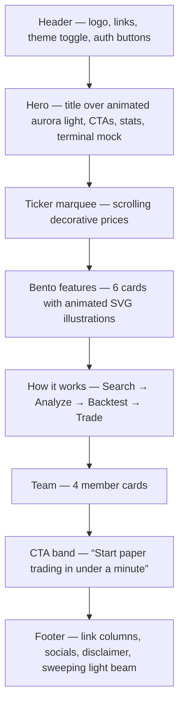

# Landing — Overview

**Plain words:** the public homepage people see before logging in — the
shop window of StockView.

## Sections, top to bottom

## Feel

Modern and calm, not flashy: one animated light in the hero, quick entrance
fades, gently pulsing dots, slowly drawing chart lines. Everything goes
static if your OS asks for reduced motion.

## Where the code lives

- Assembly: `frontend/app/page.tsx`
- Sections: `frontend/app/components/` (hero-, bento-, team-, cta-, footer-…)
- Hero shader: `app/components/hero-shader.tsx` (raw WebGL, no libraries)
- Bento illustrations: `app/components/bento-graphics.tsx`

Edit the content yourself: [customize.md](customize.md).
