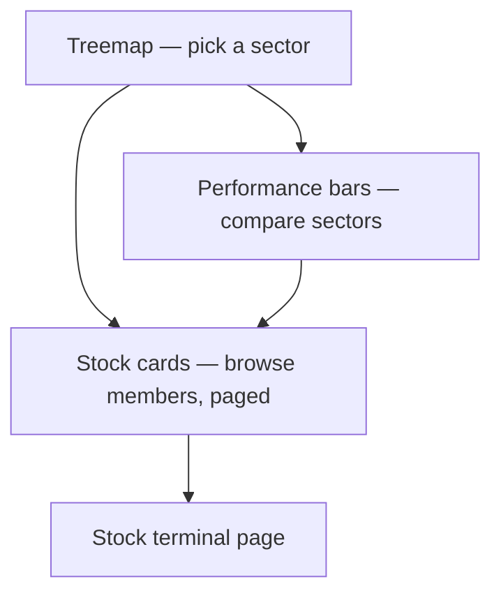

# Sectors — Overview

**Plain words:** a heat-map of the whole NIFTY 50 grouped by sector. Big
blocks = sectors whose companies add up to more market value; block colour =
today's average move (emerald = up, red = down, deeper = bigger).

## What's on it

- **Treemap** — laid out in real pixels (no stretched text), hover a block
  for its name + move, click to select. Selected block gets an emerald
  outline; others fade.
- **Performance bars** — sectors ranked by today's % change, signed
  left/right around a centre line.
- **Stock cards** — the selected sector's stocks as cards (6 per page,
  paginated) with a debounced filter; each card links to that stock's
  terminal page.

## Tooltips

Hover the small **ⓘ** icons: one explains block size/colour, one explains
the performance bars. Block hovers show name + % move.

## Where the code lives

`frontend/app/(app)/app/sectors/` — page + `components/sector-treemap.tsx`
(squarified treemap in SVG with a ResizeObserver, no chart library). Data:
`GET /api/v1/market/sector-performance` via `lib/api/market.ts`.
