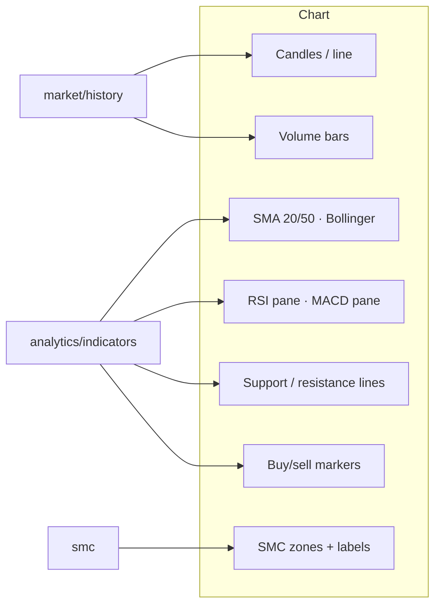

# Stock Terminal — Chart Layers

What can appear on the price chart, and where each comes from.

## The layers, toggled from the toolbar

- **Overlays** — SMA 20/50 (trend), Bollinger Bands (volatility corridor).
- **Panes below price** — RSI (momentum 0–100) and MACD (trend crosses).
- **Levels** — dashed support/resistance lines where price historically turns.
- **Markers** — small up/down arrows where buy/sell conditions fired.
- **SMC mode** (off by default) — order-block & FVG boxes, premium/discount
  bands with the gold equilibrium line, BOS/CHoCH labels; individual
  sub-toggles for zones / OBs / FVGs.

## Reading colors

Emerald = up/bullish, red = down/bearish, gold = equilibrium/hold,
cyan appears on AI elements.
